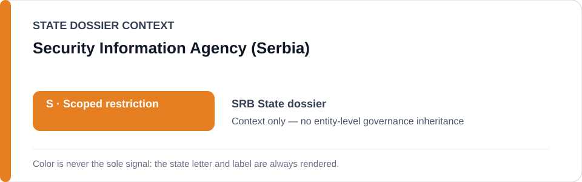
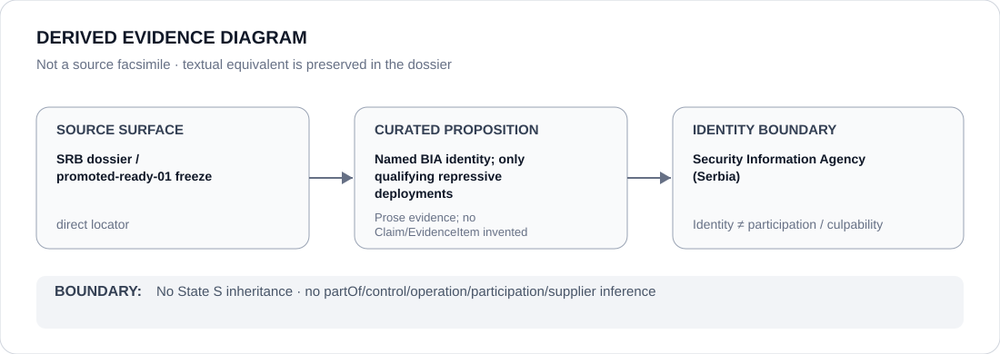

# Security Information Agency (Serbia)

> **Canonical per-entity evidence/provenance record.** This dossier has no licensing effect by itself and carries no standalone `provisional_outcome`.

## Identity scope

The Security Information Agency (BIA), represented as the Serbian intelligence agency named in the Serbia Schedule-preparation freeze. This dossier records the agency identity and the narrow project class in which BIA may be a candidate party; it does not classify Serbian intelligence activity generally.

## State governance context

The canonical `SRB` State dossier records **S — Scoped restriction** for materially evidenced repressive spyware/mobile-forensic surveillance of journalists, activists or lawful opposition and separately substantiated protest-repression operations. State `S` is **context only** and is not inherited by BIA as a whole.

## Evidence record

- `promoted-ready-01.yml` names a **BIA / Ministry of Internal Affairs repressive spyware and mobile-forensic deployment class**.
- The frozen project boundary is NoviSpy and other State-linked spyware/mobile-forensic deployments against journalists, activists or lawful opposition **where attribution is established**.
- The canonical Serbia dossier cites Amnesty forensic reporting on NoviSpy/mobile-forensics targeting and later Pegasus targeting, while retaining the requirement for project-specific attribution.

## Attribution and exclusions

Policing and intelligence generally, suppliers absent their own Material Participation and independent journalism/civil society are excluded by the freeze. This dossier creates no agency-wide operation, participation, control, command or culpability finding.

## Visual evidence

The diagram records BIA as a named identity whose renderable relevance remains conditional on materially evidenced repressive deployment and attribution.

## Evidence gaps

The canonical corpus does not turn every BIA activity, unit or officer into a qualifying project. Project-specific attribution and Material Participation remain separate propositions requiring their own evidence.

## Sources

- [Canonical Serbia State dossier](../states/SRB.md)
- [Promoted-ready Schedule freeze](../../registry/schedule-state-s-freezes/promoted-ready-01.yml)
- [Amnesty — A Digital Prison: Surveillance and the suppression of civil society in Serbia](https://www.amnesty.org/en/documents/eur70/8813/2024/en/)
- [Amnesty Security Lab — journalists targeted with Pegasus spyware](https://securitylab.amnesty.org/latest/2025/03/journalists-targeted-with-pegasus-spyware/)

## Governance boundary

Naming BIA inside a capacity-limited Serbian project class does not create a BIA-wide restriction or infer operation, participation, control, command or culpability outside specifically evidenced deployments. The orange `S` is State context only.
