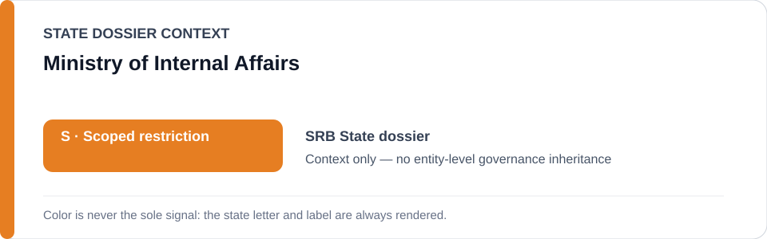
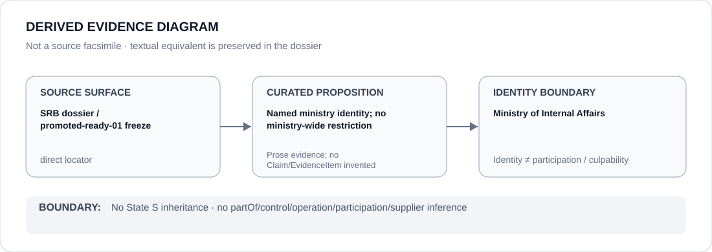

# Ministry of Internal Affairs

> **Canonical per-entity evidence/provenance record.** This dossier has no licensing effect by itself and carries no standalone `provisional_outcome`.

## Identity scope

The Serbian Ministry of Internal Affairs, represented as the ministry named together with BIA in the Serbia Schedule-preparation freeze. The ministry identity is broader than any particular police, spyware, mobile-forensic or protest-repression deployment.

## State governance context

The canonical `SRB` State dossier records **S — Scoped restriction** for a narrow class of materially evidenced repressive digital-surveillance and separately substantiated protest-repression operations. State `S` is **context only** and is not inherited by the Ministry of Internal Affairs as a whole.

## Evidence record

- `promoted-ready-01.yml` identifies the **BIA / Ministry of Internal Affairs** deployment class but limits capacity to materially evidenced repressive digital surveillance or separately substantiated protest repression.
- The freeze's project boundary concerns NoviSpy and other State-linked spyware/mobile-forensic deployments against journalists, activists or lawful opposition where attribution is established.
- The Serbia dossier deliberately describes the determination as project/system specific rather than a classification of the State apparatus generally.

## Attribution and exclusions

Policing and intelligence generally are excluded. Supplier involvement absent independent Material Participation is excluded. This dossier does not propagate the State finding across every ministry component, officer, database, investigation or public-order function.

## Visual evidence

The diagram preserves the difference between a ministry named in a capacity-limited project class and ministry-wide governance.

## Evidence gaps

The corpus does not encode unit-level participation for every Serbian digital-surveillance incident, nor does it establish that every Ministry of Internal Affairs function is implicated. Those propositions require project-specific evidence.

## Sources

- [Canonical Serbia State dossier](../states/SRB.md)
- [Promoted-ready Schedule freeze](../../registry/schedule-state-s-freezes/promoted-ready-01.yml)
- [Amnesty — A Digital Prison: Surveillance and the suppression of civil society in Serbia](https://www.amnesty.org/en/documents/eur70/8813/2024/en/)

## Governance boundary

A named ministry identity inside a frozen deployment class is not a ministry-wide restriction and does not infer control, operation, participation, command, supply or culpability for unrelated activity. The orange `S` is State context only.
