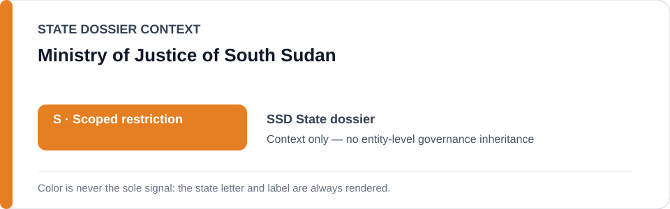
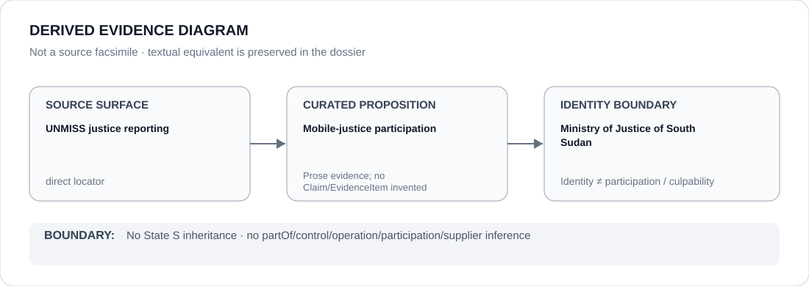

# Ministry of Justice of South Sudan

> **Canonical per-entity evidence/provenance record.** This dossier has no licensing effect by itself and carries no standalone `provisional_outcome`.

## Identity scope

The Ministry of Justice of South Sudan, represented as the justice-sector body named in the mobile-justice/remediation record.

## State governance context

The canonical `SSD` State dossier currently records **S — Scoped restriction**. That color/status is shown below as **context only**. It is not inherited by Ministry of Justice of South Sudan.

## Evidence record

- The South Sudan State dossier records continued Ministry of Justice participation, alongside the Judiciary, prosecutors and police investigators, in mobile justice interventions.
- The dossier records a southern Unity mobile court that concluded 68 cases in April 2026 and released 29 people who were wrongfully detained or had completed sentences, plus a July 2026 judicial mission to Duk.

## Attribution and exclusions

Identity and justice-sector participation do not attribute NSS, military, police or other security conduct to the Ministry, and do not establish generic remedial effectiveness or a standalone S outcome.

## Visual evidence

The diagram above is a **derived evidence diagram**, not a source facsimile. Its textual equivalent is the Evidence record, Sources and Evidence gaps sections of this dossier.

## Evidence gaps

This dossier does not yet decompose each mobile-court outcome into separate Claim/EvidenceItem records.

## Sources

- [UNMISS — southern Unity mobile court](https://unmiss.unmissions.org/en/press-releases/information-note-unmiss-supported-southern-unity-mobile-court-concludes-in)
- [UNMISS — first judicial mission to Duk](https://unmiss.unmissions.org/en/news/first-judicial-mission-to-remote-duk-county-brings-fresh-hope-for-justice)
- [Canonical State dossier provenance](../states/SSD.md)

## Governance boundary

Identity, citation, counter-evidence or visual adjacency does not create `partOf`, `controls`, `operates`, `participatesIn`, `deploys`, supplier, command, membership, culpability or Material Participation relations. Any such relation requires separate structured curation.

The state-context color is a rendering aid only. `R`, `S`, `U` or `N` shown for the State dossier is not an actor score and must never be read as an entity-level designation.
