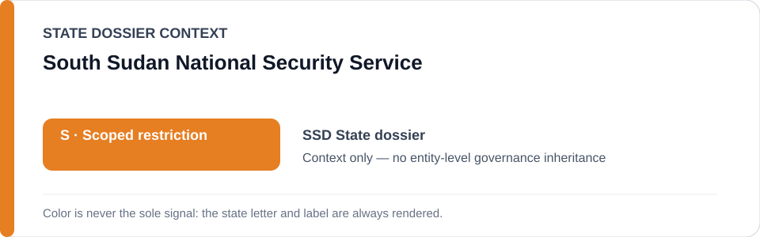
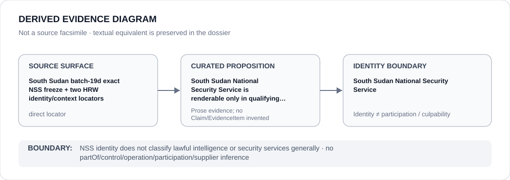

# South Sudan National Security Service

> **Canonical per-entity evidence/provenance record.** This dossier has no licensing effect by itself and carries no standalone `provisional_outcome`.

## Identity scope

This record materializes `AGENCY-SSD-NATIONAL-SECURITY-SERVICE` as the dedicated dossier for **South Sudan National Security Service**. The ABox identity does not by itself establish control, operation, participation, deployment, command, supply, culpability or any ECL governance result.

## State governance context

The canonical `SSD` State dossier records **S — Scoped restriction**. That State status is context only and is **not inherited** by South Sudan National Security Service.

## Evidence record

South Sudan National Security Service is renderable only in qualifying arrest/detention/surveillance/search/intimidation activity.

The retained repository surface is sufficiently exact for this curated proposition and is recorded as `direct`.

## Attribution and exclusions

NSS identity does not classify lawful intelligence or security services generally. Identity, organizational naming, evidence production, parent/subordinate proximity and State context are insufficient to establish a broader restriction or Material Participation.

## Visual evidence

The diagram encodes the curated proposition **“South Sudan National Security Service is renderable only in qualifying arrest/detention/surveillance/search/intimidation activity”** and terminates at the identity boundary. It does not create a new `Claim`, `EvidenceItem`, relation edge, Schedule entry or Material Participation finding.

## Evidence gaps

No source-precision gap is asserted for the curated proposition. Project/case-level Material Participation still requires its own evidence.

## Sources

- [Canonical SSD State dossier](../states/SSD.md)
- [Controlling Schedule-preparation boundary](../../registry/schedule-state-s-freezes/batch-19d-ssd-freeze.yml)
- https://www.hrw.org/news/2026/02/19/south-sudan-extend-un-investigations-stand-ready-to-respond-to-any-further

## Governance boundary

NSS identity does not classify lawful intelligence or security services generally. No `partOf`, `sameAs`, control, operation, participation, supplier or culpability edge is inferred unless separately encoded and evidenced.
