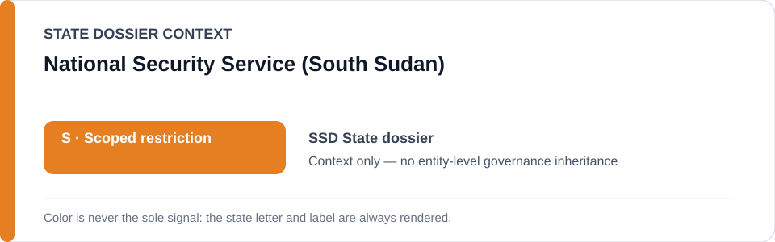
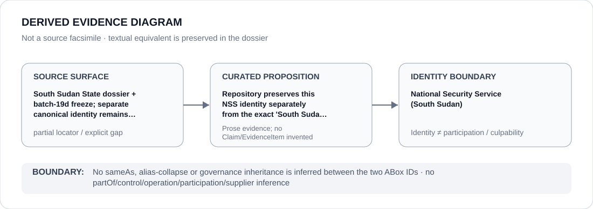

# National Security Service (South Sudan)

> **Canonical per-entity evidence/provenance record.** This dossier has no licensing effect by itself and carries no standalone `provisional_outcome`.

## Identity scope

This record materializes `AGENCY-SSD-NSS` as the dedicated dossier for **National Security Service (South Sudan)**. The ABox identity does not by itself establish control, operation, participation, deployment, command, supply, culpability or any ECL governance result.

## State governance context

The canonical `SSD` State dossier records **S — Scoped restriction**. That State status is context only and is **not inherited** by National Security Service (South Sudan).

## Evidence record

Repository preserves this NSS identity separately from the exact 'South Sudan National Security Service' freeze identity.

The repository preserves the proposition/context but not a one-to-one locator at the same identity/proposition granularity; this dossier therefore records `partial` rather than manufacturing citation precision.

## Attribution and exclusions

No sameAs, alias-collapse or governance inheritance is inferred between the two ABox IDs. Identity, organizational naming, evidence production, parent/subordinate proximity and State context are insufficient to establish a broader restriction or Material Participation.

## Visual evidence

The diagram encodes the curated proposition **“Repository preserves this NSS identity separately from the exact 'South Sudan National Security Service' freeze identity”** and terminates at the identity boundary. It does not create a new `Claim`, `EvidenceItem`, relation edge, Schedule entry or Material Participation finding.

## Evidence gaps

A one-to-one identity/proposition source mapping remains incomplete. This explicit gap must not be filled by hierarchy, alias similarity, historical adjacency or State context.

## Sources

- [Canonical SSD State dossier](../states/SSD.md)
- [Controlling Schedule-preparation boundary](../../registry/schedule-state-s-freezes/batch-19d-ssd-freeze.yml)

## Governance boundary

No sameAs, alias-collapse or governance inheritance is inferred between the two ABox IDs. No `partOf`, `sameAs`, control, operation, participation, supplier or culpability edge is inferred unless separately encoded and evidenced.
