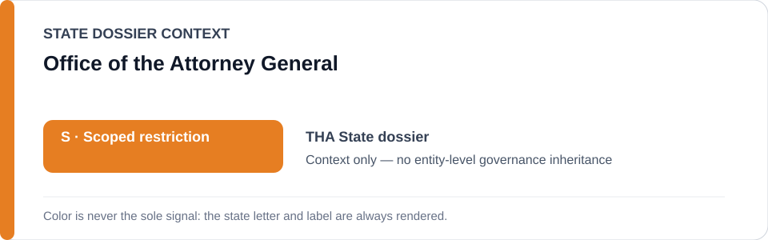
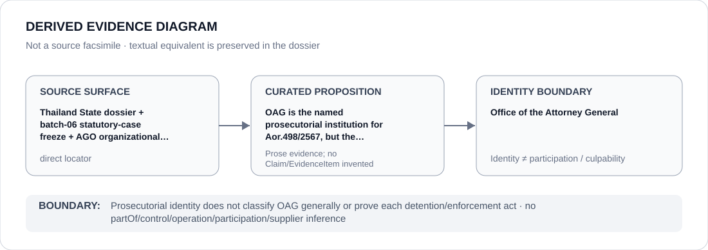

# Office of the Attorney General

> **Canonical per-entity evidence/provenance record.** This dossier has no licensing effect by itself and carries no standalone `provisional_outcome`.

## Identity scope

This record materializes `AGENCY-THA-OFFICE-ATTORNEY-GENERAL` as the dedicated dossier for **Office of the Attorney General**. The ABox identity does not by itself establish control, operation, participation, deployment, command, supply, culpability or any ECL governance result.

## State governance context

The canonical `THA` State dossier records **S — Scoped restriction**. That State status is context only and is **not inherited** by Office of the Attorney General.

## Evidence record

OAG is the named prosecutorial institution for Aor.498/2567, but the locator is identity context rather than conduct proof.

The retained repository surface is sufficiently exact for this curated proposition and is recorded as `direct`.

## Attribution and exclusions

Prosecutorial identity does not classify OAG generally or prove each detention/enforcement act. Identity, organizational naming, evidence production, parent/subordinate proximity and State context are insufficient to establish a broader restriction or Material Participation.

## Visual evidence

The diagram encodes the curated proposition **“OAG is the named prosecutorial institution for Aor.498/2567, but the locator is identity context rather than conduct proof”** and terminates at the identity boundary. It does not create a new `Claim`, `EvidenceItem`, relation edge, Schedule entry or Material Participation finding.

## Evidence gaps

No source-precision gap is asserted for the curated proposition. Project/case-level Material Participation still requires its own evidence.

## Sources

- [Canonical THA State dossier](../states/THA.md)
- [Controlling Schedule-preparation boundary](../../registry/schedule-state-s-freezes/batch-06-statutory-cases.yml)
- https://www3.ago.go.th/center/crim/

## Governance boundary

Prosecutorial identity does not classify OAG generally or prove each detention/enforcement act. No `partOf`, `sameAs`, control, operation, participation, supplier or culpability edge is inferred unless separately encoded and evidenced.
