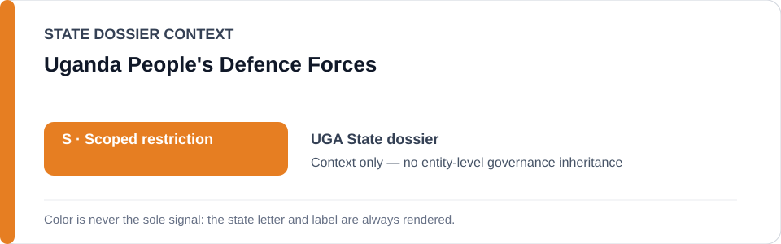
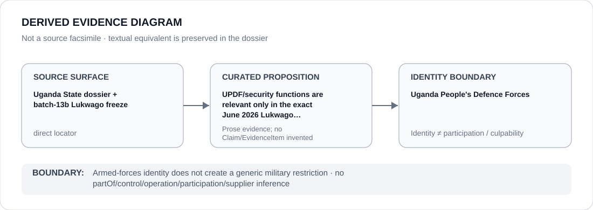

# Uganda People's Defence Forces

> **Canonical per-entity evidence/provenance record.** This dossier has no licensing effect by itself and carries no standalone `provisional_outcome`.

## Identity scope

The Uganda People's Defence Forces (UPDF), represented as the national armed-forces identity named in the Uganda security record. This dossier records the exact frozen detention-project context without classifying military activity generally.

## State governance context

The canonical `UGA` State dossier records **S — Scoped restriction** for attributable military/intelligence/police political-repression, detention and election-control projects. State `S` is context only and is not inherited by UPDF.

## Evidence record

- Current reporting documents military seizures of critics, incommunicado detention and pressure on independent media.
- `batch-13b-uga-freeze.yml` freezes only the **Erias Lukwago June 2026 detention and prosecution project**, including materially participating military/security functions in the 15–22 June seizure, incommunicado holding and transfer process.
- The State dossier expressly states that UPDF, police and courts are not generic Restricted Parties.

## Attribution and exclusions

UPDF membership, military command structure and unrelated security operations do not establish Material Participation in the Lukwago project. Only exact participating functions supported by evidence fall within the frozen boundary. UHRC, courts/remedial functions and unrelated services remain excluded.

## Visual evidence

The diagram records the exact freeze and stops at agency identity rather than converting it into a force-wide restriction.

## Evidence gaps

The repo does not identify every participating UPDF unit or individual in the frozen project. Unit, command and personnel attribution remain separate propositions.

## Sources

- [Canonical Uganda State dossier](../states/UGA.md)
- [Uganda Lukwago freeze](../../registry/schedule-state-s-freezes/batch-13b-uga-freeze.yml)
- [Human Rights Watch — Uganda military seizing government critics](https://www.hrw.org/news/2026/07/16/uganda-military-seizing-government-critics)
- [UN Special Procedures — UGA 1/2026](https://spcommreports.ohchr.org/TmSearch/RelCom?code=UGA+1%2F2026)

## Governance boundary

A materially participating military function in one frozen project does not produce a UPDF-wide restriction or infer control, command or culpability elsewhere. The orange `S` is State context only.
