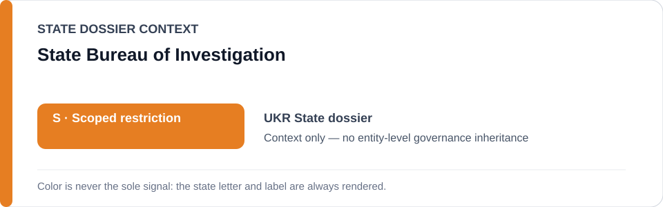
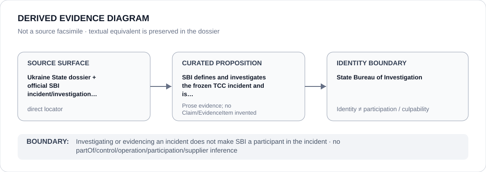

# State Bureau of Investigation

> **Canonical per-entity evidence/provenance record.** This dossier has no licensing effect by itself and carries no standalone `provisional_outcome`.

## Identity scope

This record materializes `AGENCY-UKR-STATE-BUREAU-INVESTIGATION` as the dedicated dossier for **State Bureau of Investigation**. The ABox identity does not by itself establish control, operation, participation, deployment, command, supply, culpability or any ECL governance result.

## State governance context

The canonical `UKR` State dossier records **S — Scoped restriction**. That State status is context only and is **not inherited** by State Bureau of Investigation.

## Evidence record

SBI defines and investigates the frozen TCC incident and is counter-evidence/remediation, expressly outside the restricted project.

The retained repository surface is sufficiently exact for this curated proposition and is recorded as `direct`.

## Attribution and exclusions

Investigating or evidencing an incident does not make SBI a participant in the incident. Identity, organizational naming, evidence production, parent/subordinate proximity and State context are insufficient to establish a broader restriction or Material Participation.

## Visual evidence

The diagram encodes the curated proposition **“SBI defines and investigates the frozen TCC incident and is counter-evidence/remediation, expressly outside the restricted project”** and terminates at the identity boundary. It does not create a new `Claim`, `EvidenceItem`, relation edge, Schedule entry or Material Participation finding.

## Evidence gaps

No source-precision gap is asserted for the curated proposition. Project/case-level Material Participation still requires its own evidence.

## Sources

- [Canonical UKR State dossier](../states/UKR.md)
- [Controlling Schedule-preparation boundary](../../registry/schedule-state-s-freezes/batch-21c-ukr-freeze.yml)
- https://dbr.gov.ua/news/smert-mobilizovanogo-pid-chas-perevezennya-suditimut-vijskovosluzhbovciv-kiivskih-tck

## Governance boundary

Investigating or evidencing an incident does not make SBI a participant in the incident. No `partOf`, `sameAs`, control, operation, participation, supplier or culpability edge is inferred unless separately encoded and evidenced.
