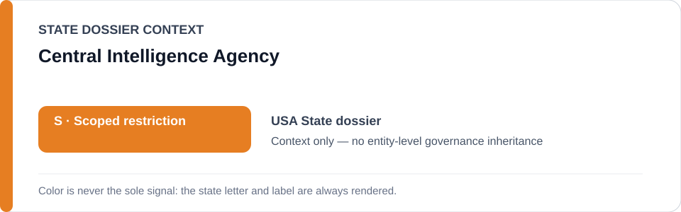
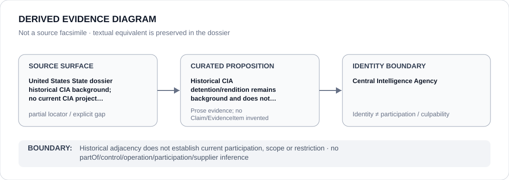

# Central Intelligence Agency

> **Canonical per-entity evidence/provenance record.** This dossier has no licensing effect by itself and carries no standalone `provisional_outcome`.

## Identity scope

This record materializes `AGENCY-USA-CIA` as the dedicated dossier for **Central Intelligence Agency**. The ABox identity does not by itself establish control, operation, participation, deployment, command, supply, culpability or any ECL governance result.

## State governance context

The canonical `USA` State dossier records **S — Scoped restriction**. That State status is context only and is **not inherited** by Central Intelligence Agency.

## Evidence record

Historical CIA detention/rendition remains background and does not create a current generic CIA project designation.

The repository preserves the proposition/context but not a one-to-one locator at the same identity/proposition granularity; this dossier therefore records `partial` rather than manufacturing citation precision.

## Attribution and exclusions

Historical adjacency does not establish current participation, scope or restriction. Identity, organizational naming, evidence production, parent/subordinate proximity and State context are insufficient to establish a broader restriction or Material Participation.

## Visual evidence

The diagram encodes the curated proposition **“Historical CIA detention/rendition remains background and does not create a current generic CIA project designation”** and terminates at the identity boundary. It does not create a new `Claim`, `EvidenceItem`, relation edge, Schedule entry or Material Participation finding.

## Evidence gaps

A one-to-one identity/proposition source mapping remains incomplete. This explicit gap must not be filled by hierarchy, alias similarity, historical adjacency or State context.

## Sources

- [Canonical USA State dossier](../states/USA.md)
- [Controlling Schedule-preparation boundary](../../registry/schedule-state-s-freezes/batch-03a-usa.yml)

## Governance boundary

Historical adjacency does not establish current participation, scope or restriction. No `partOf`, `sameAs`, control, operation, participation, supplier or culpability edge is inferred unless separately encoded and evidenced.
