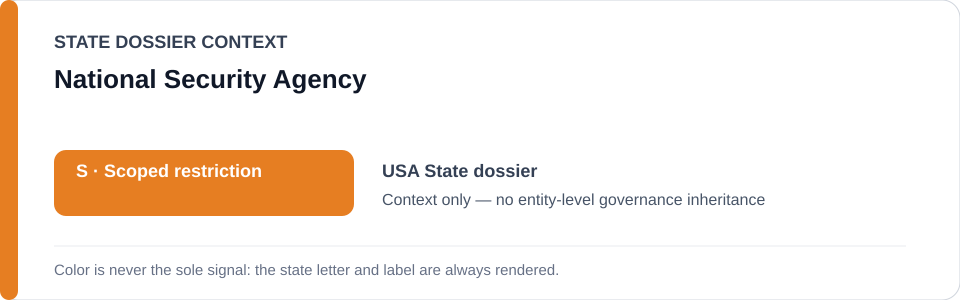
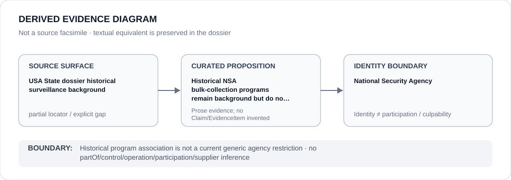

# National Security Agency

> **Canonical per-entity evidence/provenance record.** This dossier has no licensing effect by itself and carries no standalone `provisional_outcome`.

## Identity scope

The United States National Security Agency (NSA), represented as the agency named in historical surveillance background retained by the United States State dossier. That historical association does not establish a current qualifying NSA project or a generic agency restriction.

## State governance context

The canonical `USA` State dossier records **S — Scoped restriction** for identified current federal projects and materially participating agencies/units in the relevant capacity. It explicitly states that historical NSA bulk-collection programmes remain background and do not by themselves create a current project designation. State `S` is context only and is not inherited by NSA.

## Evidence record

- The USA dossier distinguishes current qualifying detention/targeting projects from historical CIA detention/rendition and NSA bulk-collection programmes.
- The current renderable State subset is Operation Epic Fury's Minab targeting chain; no NSA-wide or current NSA-specific freeze follows from historical surveillance context.
- Independent oversight such as PCLOB remains relevant counter-institutional context and further prevents treating historical capability as a present generic governance conclusion.

## Attribution and exclusions

Agency mandate, technical capability, intelligence-community membership or historical program association does not establish a current Restricted Project. A future NSA-specific finding requires a current, defined deployment and evidence that its use independently satisfies ECL criteria.

## Visual evidence

The diagram labels the source surface as historical/partial and terminates at NSA identity rather than rendering a current restriction.

## Evidence gaps

The current repository does not preserve a proposition-specific current NSA deployment that satisfies ECL criteria, nor a complete historical program locator set within the normalized State dossier. The dossier therefore remains explicitly `partial` and non-current as to the bulk-collection proposition.

## Sources

- [Canonical United States State dossier](../states/USA.md)
- [PCLOB oversight context](https://www.pclob.gov/Oversight)
- [Current USA Schedule freeze](../../registry/schedule-state-s-freezes/batch-03a-usa.yml)

## Governance boundary

Historical NSA program context is not a current generic NSA restriction. The orange `S` is State context only; any future agency-level applicability must follow a separately evidenced current project and capacity.
