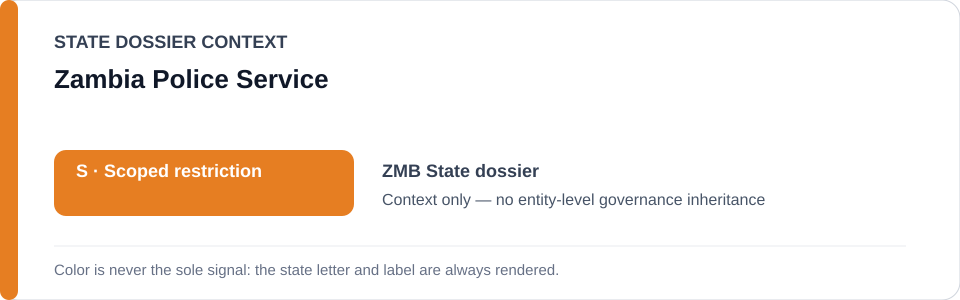
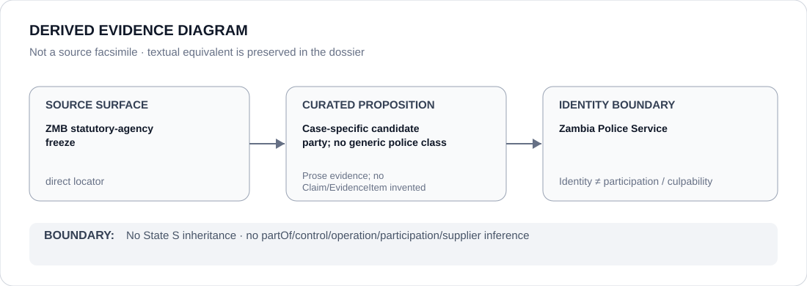

# Zambia Police Service

> **Canonical per-entity evidence/provenance record.** This dossier has no licensing effect by itself and carries no standalone `provisional_outcome`.

## Identity scope

The Zambia Police Service, represented as the statutory police agency named in the Zambia Schedule-preparation freeze. The agency identity is broader than the two exact 2026 expression-related projects that currently support renderable subsets and must not be collapsed into them.

## State governance context

The canonical `ZMB` State dossier records **S — Scoped restriction** for project-specific cyber/State-security enforcement, coercive surveillance, public-order obstruction and arbitrary political detention. The later freeze narrows renderability to case-specific police enforcement. State `S` is **context only** and is not inherited by the Zambia Police Service as a whole.

## Evidence record

- `batch-02-statutory-agency.yml` names Zambia Police Service only in Cyber Crimes Act No. 4 of 2025 or State-security enforcement against protected journalism/political expression where the **specific case independently satisfies ECL §5.6**.
- The freeze identifies the MacPherson Mukuka cyber-expression matter and the Xavier Chungu State-security/sedition detention as candidate projects.
- The Zambia dossier expressly states that statutory capability and the wider police apparatus do not form a generic restriction; the registry's police/statute locators preserve identity context and are not proposition-specific proof of prohibited conduct.

## Attribution and exclusions

Ordinary cybercrime investigation, unrelated public-order functions, courts/constitutional litigation and Cyber Security Agency activity not independently tied to a qualifying coercive deployment are excluded. This dossier creates no service-wide participation or culpability finding.

## Visual evidence

The diagram records the agency as a **case-specific candidate party** and explicitly rejects a generic police class.

## Evidence gaps

The repository does not yet encode unit/officer-level participation for every qualifying Zambia project, nor does it freeze the broader surveillance/interception or opposition-meeting scope. Those remain separate proposition and project questions.

## Sources

- [Zambia Police Service — about](https://zambiapolice.gov.zm/about-the-zambia-police-service/)
- [Zambia Police Service — legal documents](https://zambiapolice.gov.zm/legal-documents/)
- [Canonical Zambia State dossier](../states/ZMB.md)
- [Statutory-agency Schedule freeze](../../registry/schedule-state-s-freezes/batch-02-statutory-agency.yml)

## Governance boundary

Case-specific candidate-party status does not create a police-service-wide restriction, participation, control, command, culpability or Material Participation. The orange `S` is State context only.
