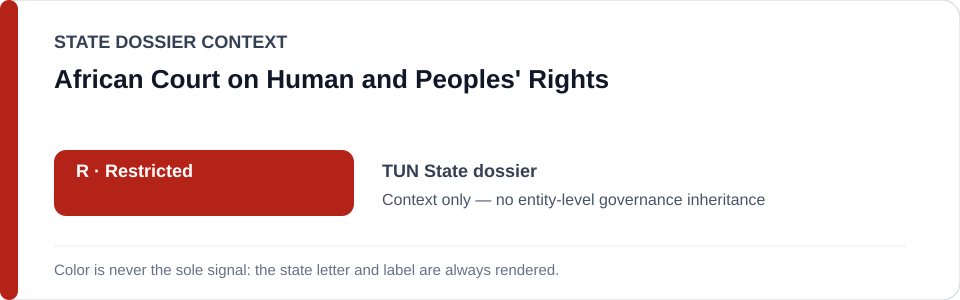
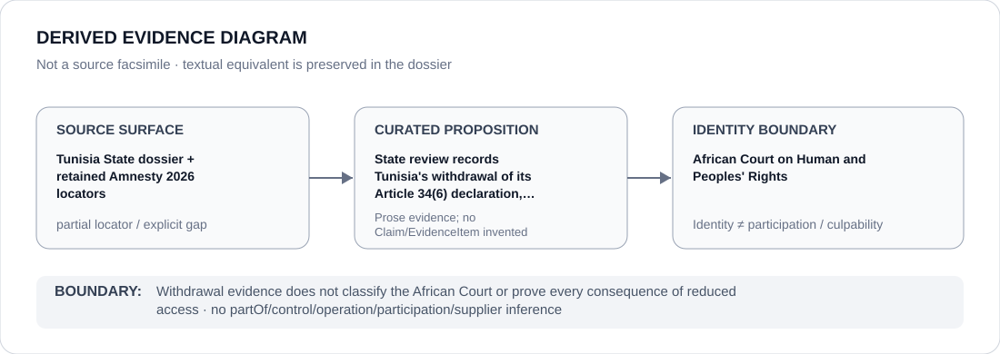

# African Court on Human and Peoples' Rights

> **Canonical per-entity evidence/provenance record.** This dossier has no licensing effect by itself and carries no standalone `provisional_outcome`.

## Identity scope

African Court on Human and Peoples' Rights, represented as the regional judicial mechanism named in the `TUN` State dossier when describing Tunisia's withdrawal of its Article 34(6) declaration. The Court's identity and external-remedy role are not an ECL classification of the Court.

## State governance context

The canonical `TUN` State dossier records **R — State apparatus Restricted** for the current executive, prosecution/judicial-administrative, migration-enforcement and civic-control apparatus. State `R` is context only and is not inherited by the African Court.

## Evidence record

- The Tunisia dossier records that Tunisia withdrew its Article 34(6) African Court declaration, removing future direct individual/NGO access to that regional remedy.
- The State dossier retains three exact Amnesty 2026 locators for the wider Tunisia review, but does not preserve a separate African Court/declaration locator mapped one-to-one to the withdrawal proposition.
- This dossier therefore preserves the State dossier's remedy-access proposition while keeping the institutional source-precision gap explicit.

## Attribution and exclusions

Withdrawal from a jurisdictional declaration is a State action described in the Tunisia dossier. It does not establish operation, control, culpability, Material Participation or a governance outcome for the African Court itself.

## Visual evidence

The diagram marks the source as partial and stops at the Court identity boundary.

## Evidence gaps

No proposition-specific African Court locator for Tunisia's Article 34(6) withdrawal is retained in the normalized State dossier. The dossier does not infer every legal consequence of reduced direct access or generic effectiveness of the Court.

## Sources

- [Canonical Tunisia State dossier](../states/TUN.md)
- [Amnesty May 2026 Tunisia civil-society record](https://www.amnesty.org/en/latest/news/2026/05/tunisia-dozens-of-ngos-at-risk-of-dissolution-as-crackdown-on-civil-society-intensifies/)
- [Amnesty Tunisia country record](https://www.amnesty.org/en/location/middle-east-and-north-africa/north-africa/tunisia/report-tunisia/)

## Governance boundary

Withdrawal evidence does not classify the African Court or prove every consequence of reduced access. State `R` and regional-remedy adjacency do not propagate to the Court.
