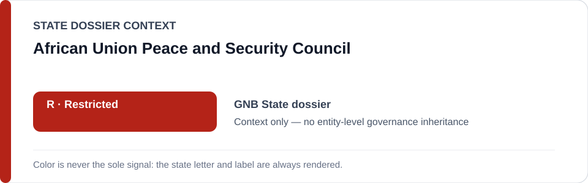
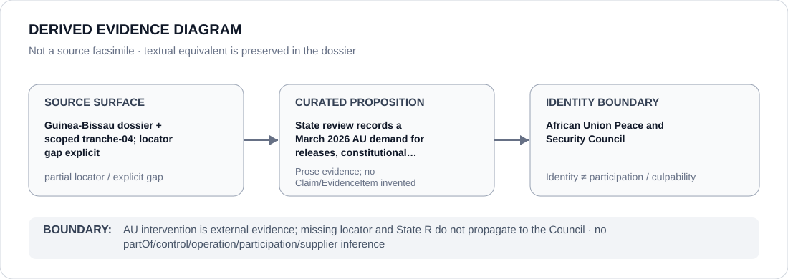

# African Union Peace and Security Council

> **Canonical per-entity evidence/provenance record.** This dossier has no licensing effect by itself and carries no standalone `provisional_outcome`.

## Identity scope

African Union Peace and Security Council, represented as the African Union organ named in the `GNB` State dossier's external-accountability record. Its intervention is evidence about Guinea-Bissau's transition; it is not participation in the military/de facto governing apparatus.

## State governance context

The canonical `GNB` State dossier records **R — current Military High Command / de facto transitional governing apparatus**. It excludes the population and a future civilian constitutional government, and records African Union intervention as external evidence. State `R` is context only and is not inherited by the AU Peace and Security Council.

## Evidence record

- The Guinea-Bissau dossier records that the African Union in March 2026 demanded unconditional release of political detainees, restoration of constitutionalism, an end to military interference and civilian subordination of the security sector.
- The dossier's historical-absorption section expressly states that the underlying tranche does not provide exact URLs or document identifiers for the AU Peace and Security Council record.
- Repository search during that normalization pass found no independent precise locator, and the dossier explicitly refuses to fabricate source precision.

## Attribution and exclusions

The Council's external demand, institutional identity or African Union role does not establish control, operation, command, implementation, Material Participation or culpability in Guinea-Bissau's military political-control project.

## Visual evidence

The diagram carries the explicit locator gap forward and terminates at the Council identity boundary.

## Evidence gaps

Exact source-locator recovery for the March 2026 AU Peace and Security Council record remains an open evidence-curation gap in the canonical State dossier. This entity dossier does not repair that gap by inference or external reconstruction.

## Sources

- [Canonical Guinea-Bissau State dossier](../states/GNB.md)
- [Historical scoped tranche 04](../../reviews/2026/adversarial/scoped/tranche-04.md)

## Governance boundary

AU intervention is external evidence; the missing locator and State `R` do not propagate to the Council. No institution-level governance outcome is created here.
