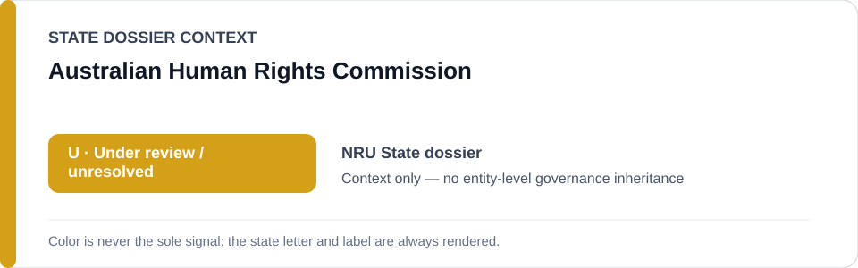
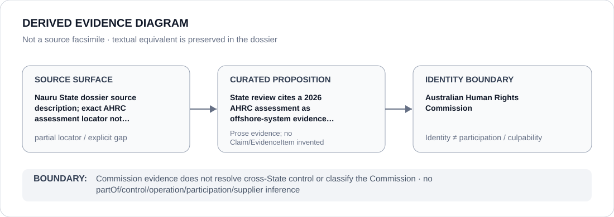

# Australian Human Rights Commission

> **Canonical per-entity evidence/provenance record.** This dossier has no licensing effect by itself and carries no standalone `provisional_outcome`.

## Identity scope

Australian Human Rights Commission, represented as the institution named in the canonical `NRU` State dossier for the repository-retained proposition below. Identity, mandate, adjudication, oversight, review, implementation or remediation activity does not itself create an ECL governance classification.

## State governance context

The canonical `NRU` State dossier records **U — Under Review**. That State-level status is context only and is not inherited by Australian Human Rights Commission.

## Evidence record

- **Source surface:** Nauru State dossier source description; exact AHRC assessment locator not retained.
- **Curated proposition:** State review cites a 2026 AHRC assessment as offshore-system evidence while Australia/Nauru control remains unresolved.
- The proposition is preserved only at the granularity supported by the repository. It is not promoted into a new structured `Claim`, `EvidenceItem`, relation edge or Material Participation finding.
- State-dossier attribution remains separate from institution identity; evidence produced by, concerning or adjacent to an institution does not establish operation, control, culpability, supply, command or participation in conduct described elsewhere.

## Attribution and exclusions

Commission evidence does not resolve cross-State control or classify the Commission. State `U`, institutional class membership and dossier/source adjacency do not propagate into a generic finding about Australian Human Rights Commission.

## Visual evidence

The diagram encodes the retained source granularity as **partial** and terminates at the institution identity boundary.

## Evidence gaps

The repository preserves the institutional proposition but not a one-to-one exact locator or document mapping at the same granularity. That source-precision gap remains explicit; no external reconstruction or inferred citation is inserted.

## Sources

- [Canonical NRU State dossier](../states/NRU.md)

## Governance boundary

This migration records identity and provenance only. It changes no State outcome, scope, Schedule entry, actor relationship, licensing effect or entity-level governance status.
