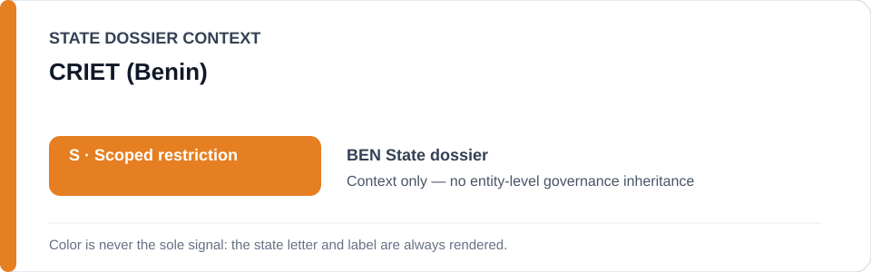
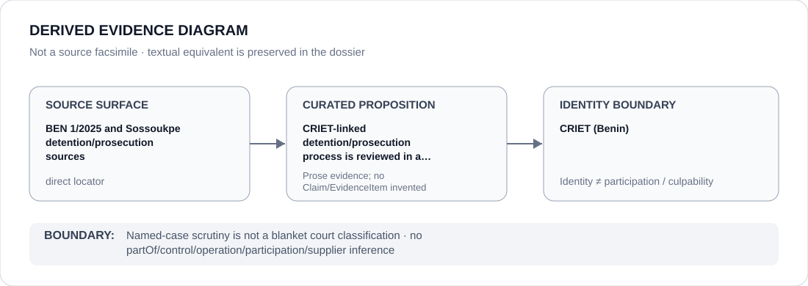

# CRIET (Benin)

> **Canonical per-entity evidence/provenance record.** This dossier has no licensing effect by itself and carries no standalone `provisional_outcome`.

## Identity scope

CRIET, represented as the Benin court/institution named in the scoped review of counterterrorism, prosecution and detention processes affecting protected journalism, political expression or rights-defence activity. Identity is not a finding that every CRIET case or function satisfies ECL criteria.

## State governance context

The canonical `BEN` State dossier records **S — Restricted with defined scope**. Its scope follows specific Digital Code, HAAC and CRIET/counterterrorism/detention projects only where materially used to suppress protected activity. The red `S` is **State context only** and is not inherited by CRIET as an institution.

## Evidence record

- The Benin dossier cites UN Special Procedures communication `BEN 1/2025` and current rights-defender reporting concerning journalist/defender Hugues Comlan Sossoukpè.
- The State record describes serious fair-trial concerns and prolonged detention before CRIET in that named case context.
- The canonical attribution rule remains process/case-specific: unrelated CRIET proceedings and ordinary public functions are not captured merely by institutional identity.

## Attribution and exclusions

A named prosecution/detention case before CRIET does not classify every CRIET proceeding, judge, prosecutor or institutional function. This dossier creates no relation edge, no blanket Material Participation finding and no presumption that future or unrelated cases fall inside the Benin `S` scope.

## Visual evidence

The diagram links proposition-specific Sossoukpe/UN source material to the limited fact that CRIET-linked detention/prosecution processes are part of a named reviewed case, then stops at the institutional identity boundary.

## Evidence gaps

This dossier does not encode the full procedural record, individual judicial responsibility, final merits or remedy in the Sossoukpe matter. It also does not establish a generic institution-wide pattern independently of the case-specific evidence retained by the State dossier.

## Sources

- [UN Special Procedures — BEN 1/2025](https://spcommreports.ohchr.org/TmSearch/RelCom?code=BEN+1%2F2025)
- [Front Line Defenders — Hugues Comlan Sossoukpè case](https://www.frontlinedefenders.org/en/case/one-year-after-his-arrest-human-rights-defender-hugues-comlan-sosoukpe-remains-custody)
- [Canonical Benin State dossier](../states/BEN.md)

## Governance boundary

Case-specific scrutiny involving CRIET does not make CRIET generically Restricted. State `S`, court identity and case adjacency do not propagate governance, participation or culpability beyond the evidenced process.
