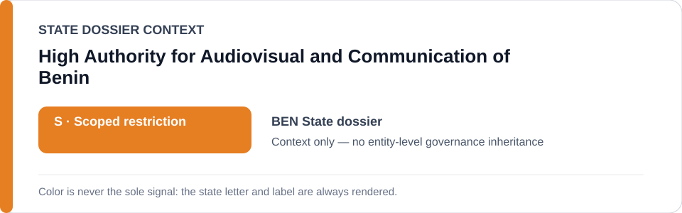
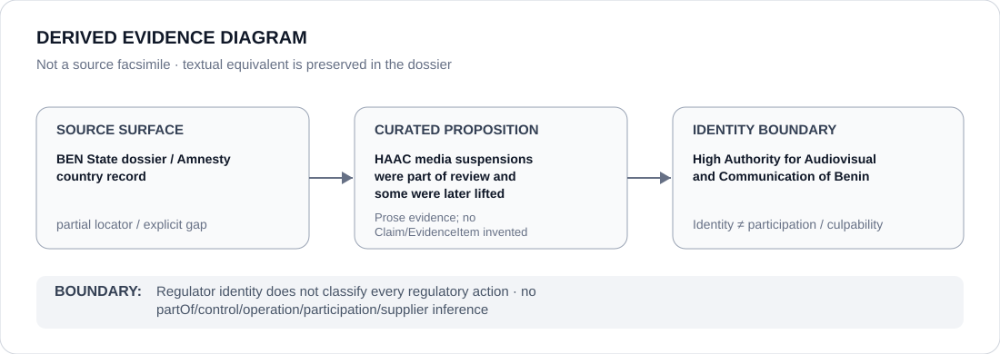

# High Authority for Audiovisual and Communication of Benin

> **Canonical per-entity evidence/provenance record.** This dossier has no licensing effect by itself and carries no standalone `provisional_outcome`.

## Identity scope

The High Authority for Audiovisual and Communication of Benin (HAAC), represented as the media regulator named in both conduct and reversibility evidence within the Benin State review. This dossier deliberately does not classify HAAC wholesale from either side of that record.

## State governance context

The canonical `BEN` State dossier records **S — Restricted with defined scope**, including specific HAAC/media-control actions when materially suppressing protected expression. It also records that suspensions of Le Patriote and Bénin Web TV were later lifted. The red `S` is **State context only** and is not inherited by HAAC.

## Evidence record

- The Benin State dossier records HAAC suspension of media outlets as part of the scoped expression/media-control review.
- The same dossier records that the suspensions of Le Patriote and Bénin Web TV were later lifted and treats that reversibility as counter-evidence.
- This mixed record is precisely why institutional identity cannot substitute for action-specific adjudication: some HAAC actions may be reviewed adversely while later reversal/remediation materially changes the evidence.

## Attribution and exclusions

HAAC identity does not make every regulatory decision Restricted, and reversal of particular suspensions does not prove generic rights-protective effectiveness. Only separately evidenced actions can be evaluated under ECL criteria.

## Visual evidence

The source surface is marked partial because the canonical dossier retains a country-level Amnesty source family rather than a HAAC-specific suspension/reversal locator.

## Evidence gaps

The exact HAAC decisions, dates, legal bases, lifting instruments and regulator-hosted URLs for the cited suspensions/reversals are not preserved in the current corpus. Those gaps remain explicit.

## Sources

- [Amnesty International — Benin country record](https://www.amnesty.org/en/location/africa/west-and-central-africa/benin/report-benin/)
- [Canonical Benin State dossier](../states/BEN.md)

## Governance boundary

An institution may appear in both potentially adverse and remedial propositions. Neither adjacency creates an institution-wide ECL outcome: State `S`, regulator identity and visual proximity do not propagate governance or Material Participation.
