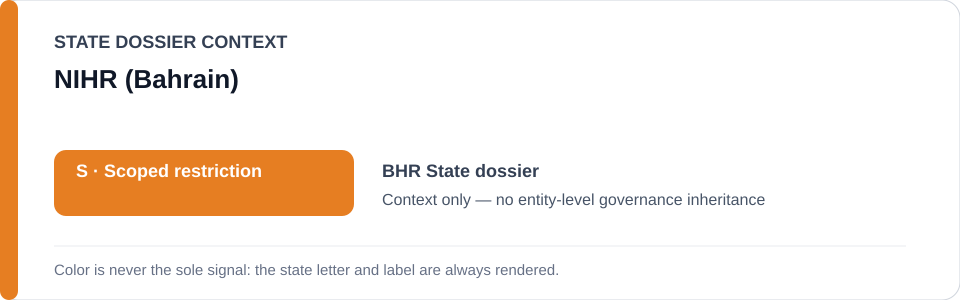
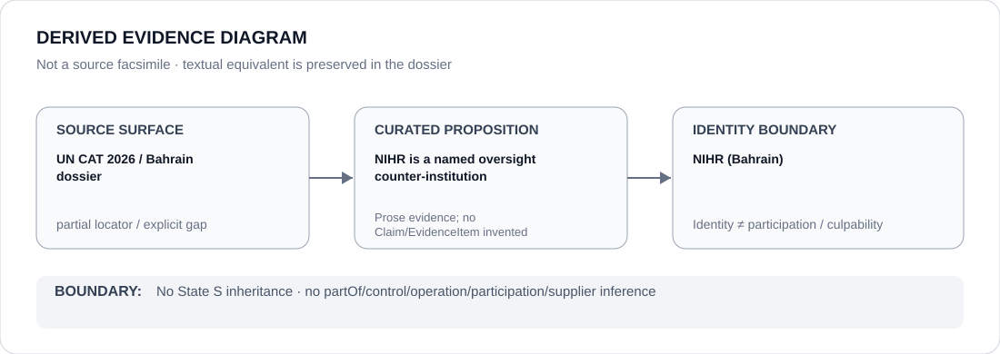

# NIHR (Bahrain)

> **Canonical per-entity evidence/provenance record.** This dossier has no licensing effect by itself and carries no standalone `provisional_outcome`.

## Identity scope

Bahrain's National Institution for Human Rights (NIHR), retained as the State-scoped oversight identity represented in the Bahrain dossier. The `NIHR` alias is not generalized to national human-rights institutions in other jurisdictions.

## State governance context

The canonical `BHR` State dossier currently records **S — Scoped restriction**. That status is shown below as **context only** and is not inherited by NIHR.

## Evidence record

- The Bahrain dossier records NIHR among the Ombudsman, Prisoners' and Detainees' Rights Commission and other complaint/monitoring bodies that form part of the State's counter-institutional record.
- The same dossier credits oversight, compensation and remedial functions where genuinely independent and effective, while preserving the UN Committee against Torture's concerns about the independence/effectiveness of existing complaint bodies.
- NIHR is therefore retained as an accountability/oversight identity, not as evidence that the scoped security, detention or coercive-interrogation restriction applies to it.

## Attribution and exclusions

The existence of NIHR does not establish that every complaint mechanism is effective, and the State dossier expressly keeps effectiveness under review. This dossier does not attribute security, intelligence, law-enforcement, detention, prosecution or judicial projects to NIHR and assigns no standalone `S` status.

## Visual evidence

The diagram preserves the State dossier/UN CAT source surface, the limited proposition that NIHR is a named oversight counter-institution, and the separate entity-identity boundary.

## Evidence gaps

The canonical State dossier preserves the relevant UN CAT source but does not provide a direct NIHR-specific 2026 locator establishing the effectiveness of particular NIHR interventions. No such effectiveness claim is inferred here.

## Sources

- [UN Committee against Torture — Bahrain concluding-observations source used by the State dossier](https://docstore.ohchr.org/SelfServices/FilesHandler.ashx?enc=%2F0aLqb%2BD86wFVEqMSMj7marJZz7q6eZ6uue7ppBVcvL3oDOFbTK%2F91v4HcvhDP%2FDvPnT%2BfyBG2imgEaPIfezcQ%3D%3D)
- [Canonical State dossier provenance](../states/BHR.md)

## Governance boundary

Identity and oversight status do not create effectiveness, security participation, executive control, culpability or Material Participation. The orange `S` is State context only.
