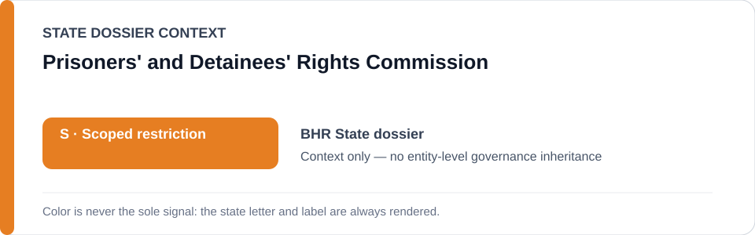
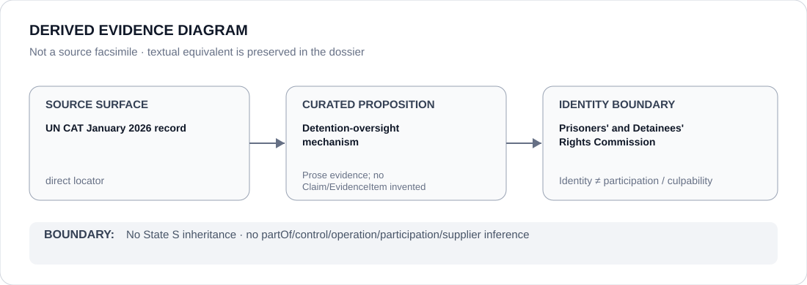

# Prisoners' and Detainees' Rights Commission

> **Canonical per-entity evidence/provenance record.** This dossier has no licensing effect by itself and carries no standalone `provisional_outcome`.

## Identity scope

Bahrain's Prisoners' and Detainees' Rights Commission, represented only as the detention-oversight institution named in the canonical Bahrain dossier.

## State governance context

The canonical `BHR` State dossier currently records **S — Scoped restriction**. That status is shown below as **context only**. It is not inherited by the Prisoners' and Detainees' Rights Commission.

## Evidence record

- The Bahrain State dossier records UN Committee against Torture concerns about torture/ill-treatment, detention safeguards, deaths in custody, accountability and the independence/effectiveness of complaint bodies.
- It separately records Bahrain's Prisoners' and Detainees' Rights Commission among existing oversight/remedial mechanisms.
- The State dossier expressly excludes genuinely remedial independent oversight from the scoped restriction.

## Attribution and exclusions

The Commission's existence does not prove its independence or effectiveness. This dossier neither attributes underlying detention abuse to the Commission nor treats the Commission's existence as sufficient remediation or as a governance downgrade.

## Visual evidence

The diagram is a derived representation of the curated CAT/counter-institution record; it is not a source facsimile.

## Evidence gaps

The current corpus does not provide a separate proposition-specific PDRC report locator in the canonical State dossier. The principal current locator is the CAT concluding-observations record, so institutional effectiveness remains an explicit gap.

## Sources

- [UN Committee against Torture — January 2026 concluding observations](https://docstore.ohchr.org/SelfServices/FilesHandler.ashx?enc=%2F0aLqb%2BD86wFVEqMSMj7marJZz7q6eZ6uue7ppBVcvL3oDOFbTK%2F91v4HcvhDP%2FDvPnT%2BfyBG2imgEaPIfezcQ%3D%3D)
- [Canonical State dossier provenance](../states/BHR.md)

## Governance boundary

Identity, oversight, citation or visual adjacency do not create participation, control, command, culpability, Material Participation or any other actor relation. Any such relation requires separate structured curation.

The orange `S` State-context color is a rendering aid only, not an institution-level designation.
