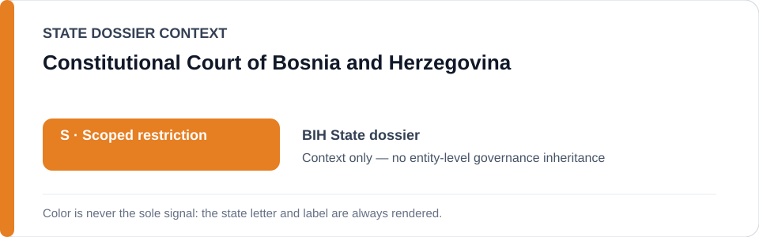
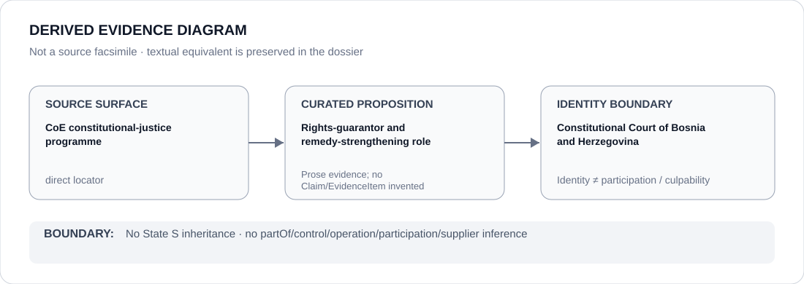

# Constitutional Court of Bosnia and Herzegovina

> **Canonical per-entity evidence/provenance record.** This dossier has no licensing effect by itself and carries no standalone `provisional_outcome`.

## Identity scope

Bosnia and Herzegovina's national Constitutional Court, represented separately from Republika Srpska entity-level institutions and projects. The canonical State dossier treats the Court as a national rights-guarantor/counter-institution.

## State governance context

The canonical `BIH` State dossier currently records **S — Scoped restriction**, strictly attributed to identified Republika Srpska coercive media/political projects. That status is shown below as **context only** and is not inherited by the Constitutional Court.

## Evidence record

- The Bosnia and Herzegovina State dossier identifies the national Constitutional Court as a meaningful rights guarantor.
- It records the Court's participation in a 2026 EU/Council of Europe programme intended to strengthen constitutional remedies and enforcement.
- The State dossier expressly excludes the Constitutional Court from the active Republika Srpska-scoped restriction absent separate evidence.

## Attribution and exclusions

Programme participation and institutional identity do not prove the effectiveness of every remedy, compliance with every judgment or independence in every case. This dossier does not attribute Republika Srpska media intimidation, prosecutions, inspections or other coercive projects to the Constitutional Court.

## Visual evidence

The diagram is a derived representation of the curated constitutional-justice provenance, not a source facsimile.

## Evidence gaps

The current corpus does not encode a case-by-case 2026 Constitutional Court effectiveness assessment or structured Claim/EvidenceItem set for the programme. The Court-specific Council of Europe programme locator is preserved, while effectiveness remains an explicit evidence gap.

## Sources

- [Council of Europe — Constitutional Justice in Bosnia and Herzegovina](https://www.coe.int/en/web/sarajevo/constitutional-justice)
- [Canonical State dossier provenance](../states/BIH.md)

## Governance boundary

Identity, remedy-programme participation, citation or visual adjacency do not create control, operation, participation, culpability or Material Participation relations. Any such relation requires separate structured curation.

The orange `S` State-context color is a rendering aid only, not an institution-level designation.
