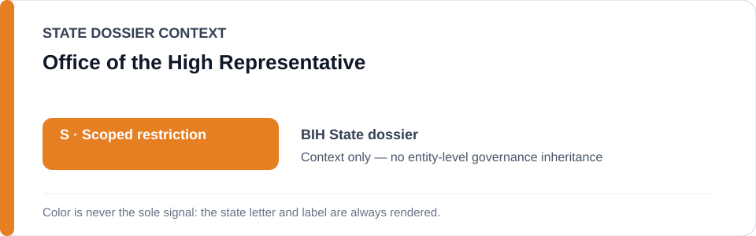
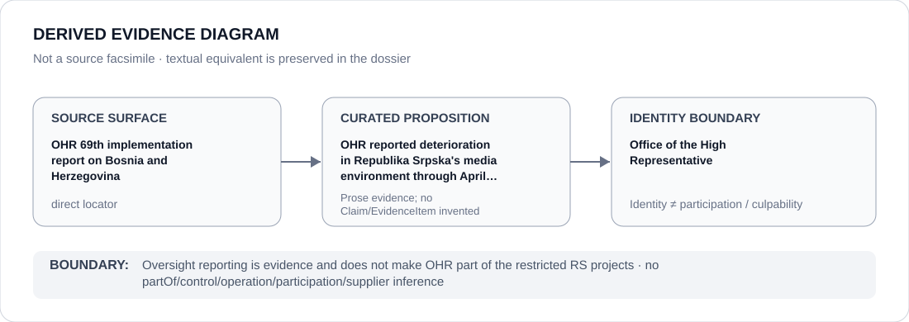

# Office of the High Representative

> **Canonical per-entity evidence/provenance record.** This dossier has no licensing effect by itself and carries no standalone `provisional_outcome`.

## Identity scope

Office of the High Representative, represented as the institution named in the canonical `BIH` State dossier for the repository-retained proposition below. Identity, mandate, adjudication, oversight, review, implementation or remediation activity does not itself create an ECL governance classification.

## State governance context

The canonical `BIH` State dossier records **S — Scoped restriction**. That State-level status is context only and is not inherited by Office of the High Representative.

## Evidence record

- **Source surface:** OHR 69th implementation report on Bosnia and Herzegovina.
- **Curated proposition:** OHR reported deterioration in Republika Srpska's media environment through April 2026.
- The proposition is preserved only at the granularity supported by the repository. It is not promoted into a new structured `Claim`, `EvidenceItem`, relation edge or Material Participation finding.
- State-dossier attribution remains separate from institution identity; evidence produced by, concerning or adjacent to an institution does not establish operation, control, culpability, supply, command or participation in conduct described elsewhere.

## Attribution and exclusions

Oversight reporting is evidence and does not make OHR part of the restricted RS projects. State `S`, institutional class membership and dossier/source adjacency do not propagate into a generic finding about Office of the High Representative.

## Visual evidence

The diagram encodes the retained source granularity as **direct** and terminates at the institution identity boundary.

## Evidence gaps

The retained repository source surface is sufficiently exact for the curated proposition above. That exactness is proposition-specific and does not establish broader institutional effectiveness, participation or governance.

## Sources

- [Canonical BIH State dossier](../states/BIH.md)
- https://www.ohr.int/69th-report-of-the-high-representative-for-implementation-of-the-peace-agreement-on-bosnia-and-herzegovina-to-the-secretary-general-of-the-un-/

## Governance boundary

This migration records identity and provenance only. It changes no State outcome, scope, Schedule entry, actor relationship, licensing effect or entity-level governance status.
