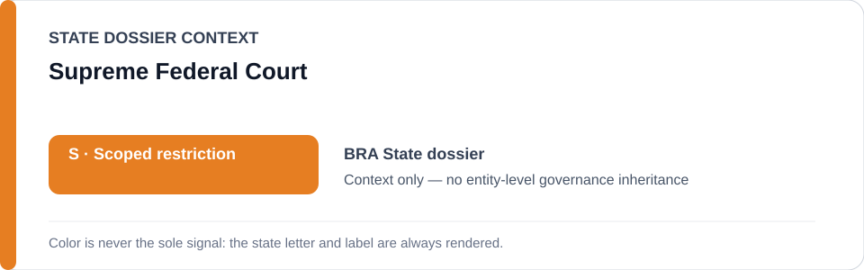
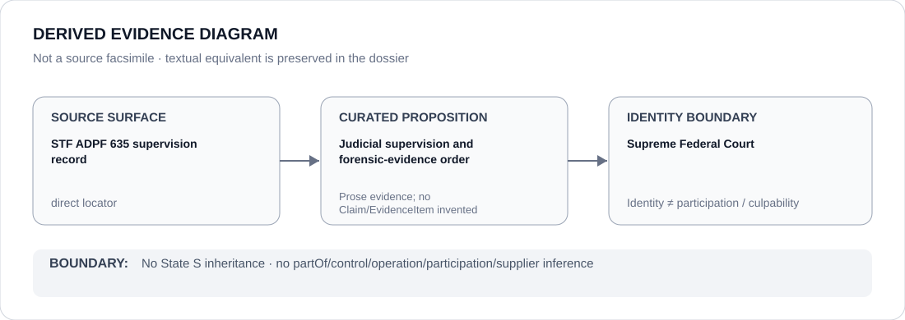

# Supreme Federal Court

> **Canonical per-entity evidence/provenance record.** This dossier has no licensing effect by itself and carries no standalone `provisional_outcome`.

## Identity scope

Brazil's Supreme Federal Court (STF), represented as the judicial counter-institution supervising police policy under ADPF 635 in the canonical Brazil dossier.

## State governance context

The canonical `BRA` State dossier currently records **S — Scoped restriction**. That status is shown below as **context only**. It is not inherited by the Supreme Federal Court.

## Evidence record

- The Brazil State dossier records active Supreme Federal Court supervision of police policy under ADPF 635.
- It records that in February 2026 the STF ordered Rio operation imagery sent to the Federal Police for forensic examination and required clarification of the State prosecutor's role.
- The State dossier expressly excludes STF, independent prosecution/forensics and remediation from the active scoped restriction.

## Attribution and exclusions

Judicial supervision does not establish that every remedial order is effective or complied with. This dossier does not attribute police operations to the STF and does not assign the Court a standalone `S` outcome.

## Visual evidence

The diagram is a derived representation of the ADPF 635 supervision record, not a source facsimile.

## Evidence gaps

The current dossier does not enumerate the full ADPF 635 procedural history or encode each judicial order as a structured Claim/EvidenceItem. It preserves the exact February 2026 STF locator used by the canonical State dossier.

## Sources

- [STF — February 2026 Rio operation imagery order](https://noticias.stf.jus.br/postsnoticias/stf-determina-ao-governo-do-rj-que-apresente-imagens-de-operacao-nos-complexos-do-alemao-e-da-penha/)
- [Canonical State dossier provenance](../states/BRA.md)

## Governance boundary

Identity, judicial supervision, citation or visual adjacency do not create police command, operation, participation, culpability or Material Participation relations. Any such relation requires separate structured curation.

The orange `S` State-context color is a rendering aid only, not an institution-level designation.
