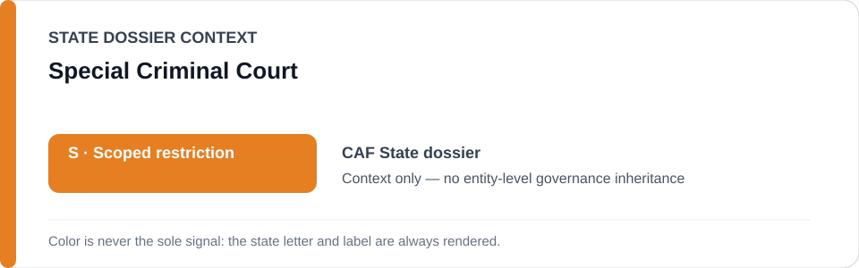
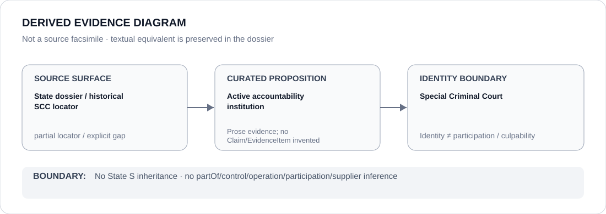

# Special Criminal Court

> **Canonical per-entity evidence/provenance record.** This dossier has no licensing effect by itself and carries no standalone `provisional_outcome`.

## Identity scope

The Special Criminal Court (SCC) of the Central African Republic, represented as the accountability institution named in the canonical State dossier and its retained historical evidence.

## State governance context

The canonical `CAF` State dossier currently records **S — Scoped restriction**. That status is shown below as **context only** and is not inherited by the Special Criminal Court.

## Evidence record

- The current Central African Republic dossier records the Special Criminal Court and other accountability institutions as active counter-evidence.
- The active State scope expressly excludes the Special Criminal Court and independent investigation/remediation.
- The State dossier retains an Amnesty Special Criminal Court source from the earlier broader review as historical provenance, while making clear that the older security-sector scope was superseded by the narrower 2026 Ouanda-Djalé basis.

## Attribution and exclusions

SCC identity and accountability activity do not prove generic remedial effectiveness and do not attribute FACA or other security conduct to the Court. Historical counter-evidence does not revive superseded State scope.

## Visual evidence

The diagram marks the source surface as partial because the current State dossier identifies the SCC institutionally while the most specific retained SCC locator sits in historical provenance.

## Evidence gaps

The current State dossier does not provide a proposition-specific 2026 SCC decision or case locator tied to the active Ouanda-Djalé scope. No such decision is inferred here.

## Sources

- [Amnesty International — retained Special Criminal Court historical locator](https://www.amnesty.org/en/latest/news/2026/02/car-special-criminal-court-2/)
- [Canonical State dossier provenance](../states/CAF.md)

## Governance boundary

Identity, judicial/accountability activity, citation or visual adjacency do not create security-sector participation, command, culpability or Material Participation. The orange `S` is State context only.
