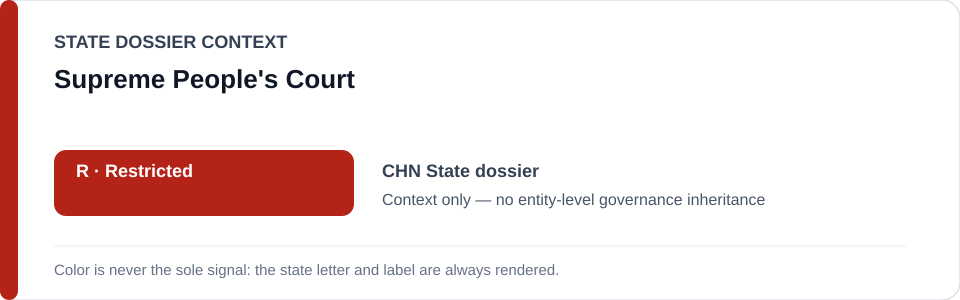
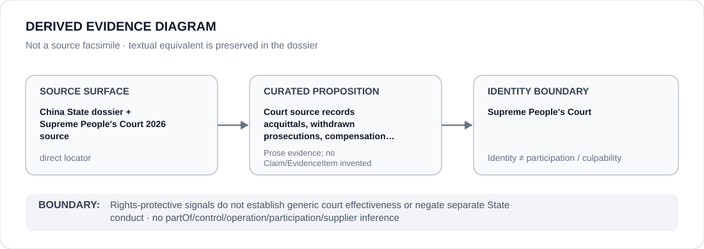

# Supreme People's Court

> **Canonical per-entity evidence/provenance record.** This dossier has no licensing effect by itself and carries no standalone `provisional_outcome`.

## Identity scope

This dossier represents **Supreme People's Court** as the institution identified in the canonical `CHN` review record. Identity is kept separate from any case, project, authority, member, subordinate body or participant unless the repository supplies a separate attributable relation or Claim.

## State governance context

The canonical `CHN` State dossier records **R — Restricted**. That State status is context only. It is not inherited by Supreme People's Court, and neither institutional class membership nor adjacency to the State dossier creates an entity-level governance outcome.

## Evidence record

- **Source granularity:** `direct`. The repository retains an exact source surface adequate for the curated proposition below.
- **Curated proposition:** Court source records acquittals, withdrawn prosecutions, compensation and defence-rights measures as counter-evidence.
- The source surface is used only for that proposition and its provenance boundary. It is not promoted into evidence for unrelated conduct, generic institutional effectiveness, control, participation or culpability.
- Where the institution appears in a restrictive State context, that context remains a property of the State review or exact frozen project, not of the institution as a whole.

## Attribution and exclusions

Rights-protective signals do not establish generic court effectiveness or negate separate State conduct. No `partOf`, control, operation, supply, command, membership, participation or Material Participation edge is inferred from this dossier. Producing evidence, adjudicating, reviewing, monitoring, administering, reforming or being named in a freeze does not by itself establish responsibility for the conduct documented elsewhere.

## Visual evidence

The diagram is derived from the manifest and terminates at the identity boundary. It is not a source facsimile and does not add a Claim or EvidenceItem.

## Evidence gaps

No source-precision gap is asserted for the curated proposition at the repository level. This does **not** mean the record proves every broader proposition about Supreme People's Court; only the proposition stated above is treated as locator-complete.

## Sources

- [Canonical China State dossier](../states/CHN.md)
- https://www.court.gov.cn/zixun/xiangqing/492671.html
- [State R identity freeze](../../registry/schedule-state-r-freeze.yml)

## Governance boundary

Rights-protective signals do not establish generic court effectiveness or negate separate State conduct. State `R` is contextual only, this dossier is non-operative, and any future institution-level applicability requires separately evidenced and capacity-specific attribution.
