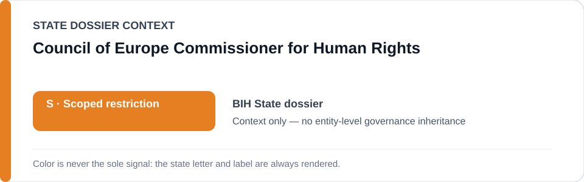
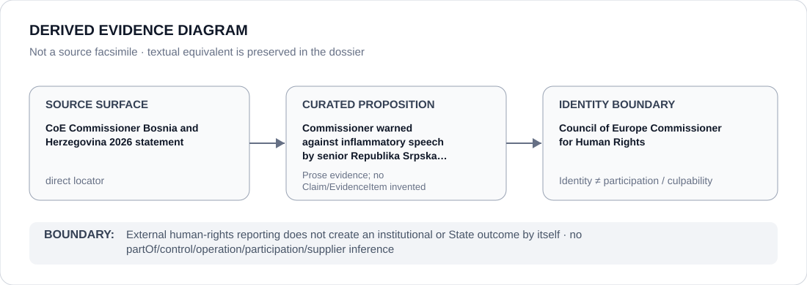

# Council of Europe Commissioner for Human Rights

> **Canonical per-entity evidence/provenance record.** This dossier has no licensing effect by itself and carries no standalone `provisional_outcome`.

## Identity scope

The Council of Europe Commissioner for Human Rights, represented as the external human-rights office whose 2026 Bosnia and Herzegovina statement is retained as direct evidence. Reporting about political conduct does not itself classify the Commissioner or the State.

## State governance context

The canonical `BIH` State dossier records **S — Scoped restriction**, strictly attributed to identified Republika Srpska coercive media/political projects. Bosnia and Herzegovina as a State is not a Restricted Party, and State-context `S` is not inherited by the Commissioner.

## Evidence record

- The Bosnia and Herzegovina dossier records that the Commissioner separately warned about inflammatory speech from the highest Republika Srpska political leadership.
- The exact Council of Europe Commissioner locator was restored into the canonical State dossier during historical-evidence absorption.
- The statement is used alongside separate Office of the High Representative evidence and national counter-institutional evidence; it is not treated as a substitute for project-specific attribution.

## Attribution and exclusions

Human-rights monitoring, public statements and external review do not establish participation in Republika Srpska coercive media/political projects. The Commissioner is not inferred to control, operate or remediate those projects merely through reporting.

## Visual evidence

The diagram retains the Commissioner statement as a direct source surface and terminates at external monitoring-institution identity.

## Evidence gaps

The dossier preserves only the exact statement proposition retained by the Bosnia and Herzegovina record. It does not generalize that statement to every RS actor, every speech event or generic institutional effectiveness.

## Sources

- [Canonical Bosnia and Herzegovina State dossier](../states/BIH.md)
- [Council of Europe Commissioner for Human Rights — Bosnia and Herzegovina statement](https://www.coe.int/ca/web/commissioner/-/bosnia-and-herzegovina-politicians-in-republika-srpska-should-refrain-from-hateful-speech)

## Governance boundary

External human-rights reporting is evidence about a defined proposition, not participation in the reported conduct. Bosnia and Herzegovina/Republika Srpska context does not propagate to the Commissioner.
