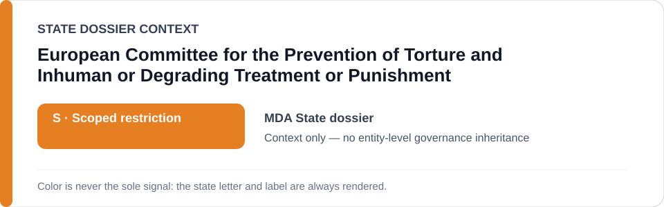
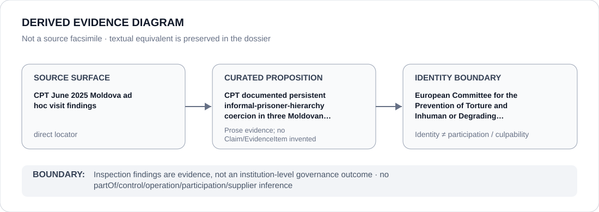

# European Committee for the Prevention of Torture and Inhuman or Degrading Treatment or Punishment

> **Canonical per-entity evidence/provenance record.** This dossier has no licensing effect by itself and carries no standalone `provisional_outcome`.

## Identity scope

The European Committee for the Prevention of Torture and Inhuman or Degrading Treatment or Punishment (CPT), represented as the Council of Europe monitoring institution whose Moldova inspection findings are retained as direct evidence. Inspection and monitoring identity is not itself an ECL governance classification.

## State governance context

The canonical `MDA` State dossier records **S — Scoped restriction** for defined detention, ill-treatment/remedy and three-penitentiary informal-prisoner-hierarchy projects. State `S` is context only and is not inherited by the CPT.

## Evidence record

- During its June 2025 ad hoc Moldova visit, the CPT visited Penitentiary no. 6 in Soroca, no. 15 in Cricova and no. 2 in Lipcani.
- The retained 2026 Council of Europe publication reports that long-standing recommendations concerning informal prisoner hierarchies remained largely unimplemented in all three establishments, with intimidation, violence and de facto relinquishment of authority/control among the documented concerns.
- The same State dossier records counter-evidence from the visit, including no allegations of physical ill-treatment by staff in the three establishments and improvements in food and injury reporting.

## Attribution and exclusions

CPT inspection, monitoring, recommendations and publication do not constitute operation, control or participation in the inspected detention project. The monitored authorities and the monitoring institution remain separate attribution subjects.

## Visual evidence

The diagram treats the CPT visit findings as a direct evidence surface and stops at monitoring-institution identity.

## Evidence gaps

The dossier does not infer conditions at facilities not covered by the retained visit or treat every CPT recommendation as proof of either violation or remediation. Facility/project scope remains proposition-specific.

## Sources

- [Canonical Moldova State dossier](../states/MDA.md)
- [Council of Europe — CPT Moldova prison visit findings](https://www.coe.int/en/web/chisinau/-/prisons-in-the-republic-of-moldova-anti-torture-committee-finds-progress-but-calls-for-resolute-action-to-tackle-informal-prisoner-hierarchies)

## Governance boundary

Monitoring and publishing findings about a State detention project does not make the CPT part of that project and does not cause Moldova's `S` to propagate to the institution.
