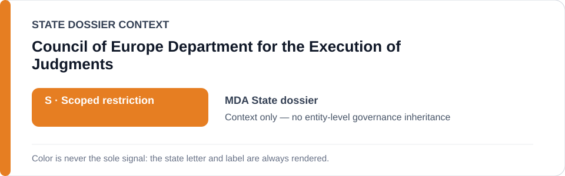
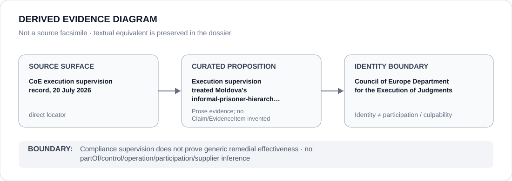

# Council of Europe Department for the Execution of Judgments

> **Canonical per-entity evidence/provenance record.** This dossier has no licensing effect by itself and carries no standalone `provisional_outcome`.

## Identity scope

The Council of Europe Department for the Execution of Judgments, represented as the execution-supervision institution cited in the Moldova record. Its compliance-monitoring activity is retained as direct provenance and is not converted into a generic institutional effectiveness conclusion.

## State governance context

The canonical `MDA` State dossier records **S — Scoped restriction** for defined detention, ill-treatment/remedy and three-penitentiary informal-prisoner-hierarchy projects. State `S` is context only and is not inherited by the Department for the Execution of Judgments.

## Evidence record

- On 20 July 2026, the retained Council of Europe execution-supervision record described Moldova's informal-prisoner-hierarchy problem as systemic and underlined the need for a comprehensive national strategy.
- The Moldova dossier uses that current execution posture, together with the Petrov judgment and CPT findings, to avoid treating the documented problem as already durably remediated.
- Execution supervision is remedial/compliance provenance; it does not itself define the ECL Schedule class or prove implementation success.

## Attribution and exclusions

Monitoring execution of judgments, meeting with national authorities or identifying outstanding implementation needs does not make the Department an operator, controller or participant in the underlying detention practices.

## Visual evidence

The diagram preserves the July 2026 execution-supervision record as direct evidence and terminates at the Department's identity boundary.

## Evidence gaps

The retained locator establishes the specific current supervision proposition. This dossier does not infer compliance outcomes beyond the record or treat supervision activity as proof that remedies are effective.

## Sources

- [Canonical Moldova State dossier](../states/MDA.md)
- [Council of Europe Department for the Execution of Judgments — Moldova execution-supervision record](https://www.coe.int/uk/web/execution/-/meeting-with-the-advisory-council-of-the-government-agent-of-the-republic-of-moldova-2)

## Governance boundary

Execution supervision is evidence about compliance posture, not participation in the underlying project and not automatic proof of remedial effectiveness. Moldova's `S` does not propagate to the Department.
