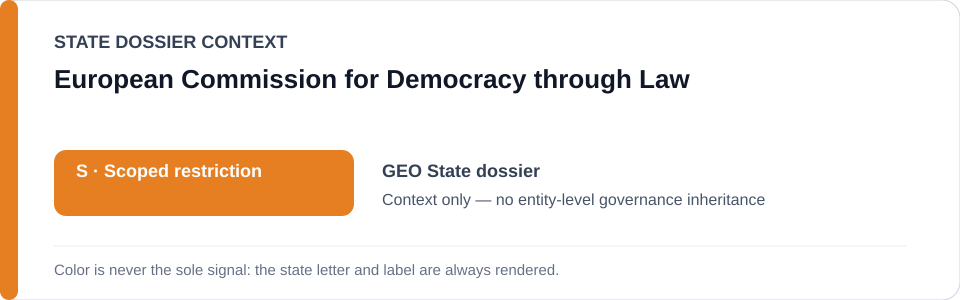
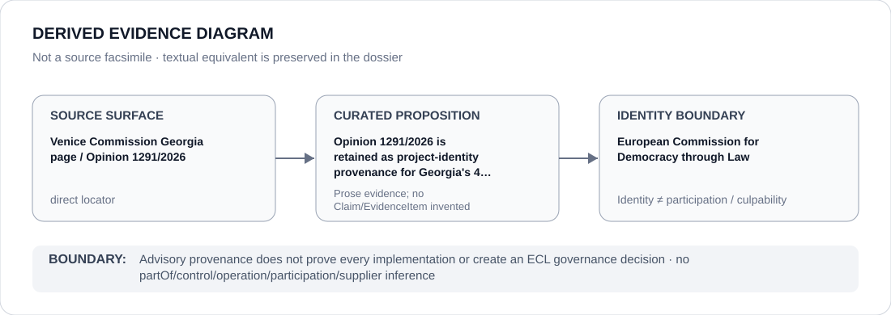

# European Commission for Democracy through Law

> **Canonical per-entity evidence/provenance record.** This dossier has no licensing effect by itself and carries no standalone `provisional_outcome`.

## Identity scope

European Commission for Democracy through Law, represented as the institution named in the `GEO` State dossier for the exact evidence proposition preserved below. Institutional identity, review, adjudication, monitoring or reporting is not itself an ECL governance classification.

## State governance context

The canonical `GEO` State dossier records **S — Scoped restriction** with scope concerning executive/police protest repression, politically motivated prosecution/detention, coercive foreign-influence/grant controls and specified media/civic-space repression. State `S` is context only and is not inherited by European Commission for Democracy through Law.

## Evidence record

- The Georgia State dossier retains the Venice Commission Georgia page as the exact institutional source surface relevant to the current project boundary.
- Its historical-absorption section identifies Venice Commission Opinion 1291/2026 as statutory/project-identity provenance for the implementation of the 4 March 2026 amendments.
- The State dossier expressly limits renderability to implementation materially burdening protected association, independent civic activity, media activity or peaceful political participation; the locator is not proof that every implementation is prohibited conduct.

## Attribution and exclusions

The retained source proposition concerns evidence, adjudication, monitoring, review or accountability activity by the named institution. It does not establish operation, control, ownership, command, implementation, supply or Material Participation in the State/project conduct described elsewhere in the `GEO` dossier.

## Visual evidence

The diagram treats the retained locator as a direct evidence surface and terminates at the institution identity boundary.

## Evidence gaps

This dossier does not reconstruct propositions beyond those expressly retained in the Georgia State dossier. The Venice Commission source is used for project identity and advisory provenance, not for inferred participation, control or outcome.

## Sources

- [Canonical GEO State dossier](../states/GEO.md)
- [Venice Commission Georgia page / Opinion 1291/2026](https://www.coe.int/en/web/venice-commission/georgia)

## Governance boundary

Advisory provenance does not prove every implementation or create an ECL governance decision. State `S` and source adjacency do not propagate to European Commission for Democracy through Law.
