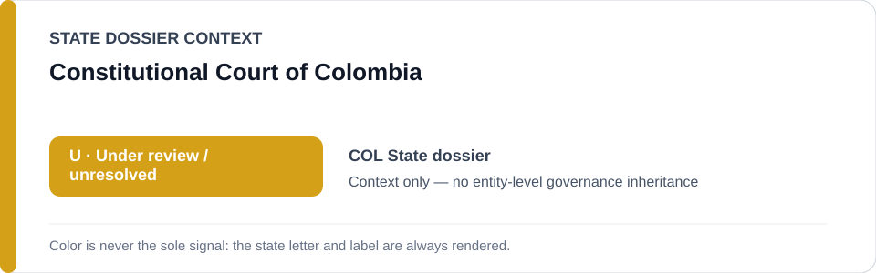
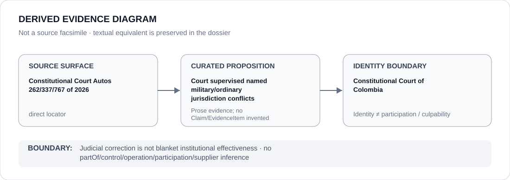

# Constitutional Court of Colombia

> **Canonical per-entity evidence/provenance record.** This dossier has no licensing effect by itself and carries no standalone `provisional_outcome`.

## Identity scope

The Constitutional Court of Colombia, represented here as the constitutional court that resolved or supervised the named 2026 military-versus-ordinary jurisdiction disputes preserved in the Colombia State dossier. Court identity is separate from Military Criminal Justice, police, armed-forces and prosecutorial actors.

## State governance context

The canonical `COL` State dossier currently records **U — Under Review** after the prior `S` was downgraded when exact 2026 cases showed constitutional correction, procedural supervision or unresolved status rather than a sufficiently current frozen obstruction project. That `U` is **context only** and is not inherited by the Court.

## Evidence record

- Auto 262/2026 (`CJU-7386`) records a military-jurisdiction claim concerning the December 2024 death of Juan Sebastián Collantes Betancourth; the Constitutional Court ultimately assigned the matter to ordinary jurisdiction.
- Auto 337/2026 (`CJU-7374`) records the Court requiring the military criminal judge to state expressly whether it claimed or rejected competence because the procedural conditions for a jurisdictional conflict were not yet complete.
- Auto 767/2026 records a military prosecutor declining military jurisdiction before the Court assigned the matter to ordinary jurisdiction.
- The State dossier uses these exact decisions as current counter-evidence against treating military-jurisdiction intervention as a uniformly successful or still-frozen obstruction project.

## Attribution and exclusions

These decisions establish specific judicial actions in identified jurisdictional disputes. They do not prove blanket institutional independence or effectiveness, and they do not make the Court responsible for the underlying deaths, military claims, police conduct or investigative delays. No control, participation, command or Material Participation relation is created.

## Visual evidence

The diagram links the three official 2026 Court decision locators to the limited proposition that the Court supervised named jurisdictional conflicts, then stops at the institutional identity boundary.

## Evidence gaps

This dossier does not generalize from three reviewed decisions to the Court's overall independence, timeliness, compliance rate or effectiveness across Colombia's military/ordinary-jurisdiction system. Any broader claim requires separate proposition-specific evidence.

## Sources

- [Constitutional Court — Auto 262/2026](https://www.corteconstitucional.gov.co/relatoria/autos/2026/a262-26.htm)
- [Constitutional Court — Auto 337/2026](https://www.corteconstitucional.gov.co/relatoria/autos/2026/a337-26.htm)
- [Constitutional Court — Auto 767/2026](https://www.corteconstitucional.gov.co/relatoria/autos/2026/a767-26.htm)
- [Canonical Colombia State dossier](../states/COL.md)

## Governance boundary

Judicial correction, case assignment and State-dossier counter-evidence do not create a standalone ECL outcome for the Court. The amber `U` shown in the status graphic is State context only; identity and remedial adjacency do not imply governance, participation or culpability.
