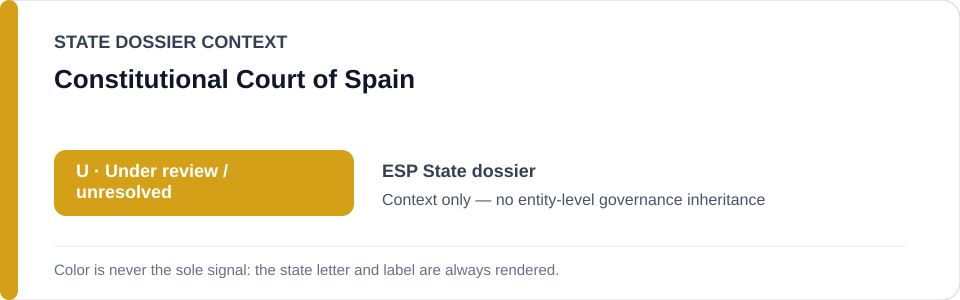
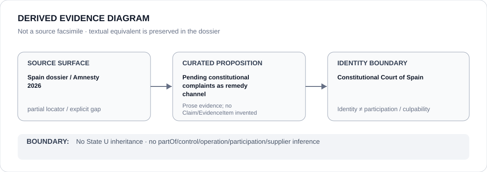

# Constitutional Court of Spain

> **Canonical per-entity evidence/provenance record.** This dossier has no licensing effect by itself and carries no standalone `provisional_outcome`.

## Identity scope

Spain's Constitutional Court, represented as a constitutional-remedy institution distinct from the public-order, expression, infiltration/surveillance and eviction projects under State-level review.

## State governance context

The canonical `ESP` State dossier currently records **U — Under Review**. That status is shown below as **context only** and is not inherited by the Constitutional Court.

## Evidence record

- The Spain State dossier records that complaints connected to the reviewed public-order/expression record remain before the Constitutional Court.
- It treats courts, Parliament, ombuds institutions and democratic contestability as material counter-evidence against a stable systematic ECL project finding.
- The dossier does not state the merits or outcome of the pending constitutional complaints.

## Attribution and exclusions

The existence of pending complaints establishes a live constitutional-remedy channel, not the eventual disposition of those complaints and not proof of effective remediation. This dossier does not attribute police infiltration, protest enforcement, surveillance or eviction conduct to the Court.

## Visual evidence

The diagram is a derived representation of the pending-remedy provenance and explicitly marks the source locator as partial.

## Evidence gaps

The canonical State dossier currently supplies a general Spain rights-report locator rather than a case-specific Constitutional Court docket or judgment locator. The exact complaints, procedural posture and eventual outcomes therefore remain unresolved in this per-entity dossier.

## Sources

- [Amnesty International — Spain 2026 country report](https://www.amnesty.org/en/location/europe-and-central-asia/spain/report-spain/)
- [Canonical State dossier provenance](../states/ESP.md)

## Governance boundary

Identity, pending litigation, citation or visual adjacency do not create police command, operation, participation, culpability or Material Participation relations. A future judgment would require separate proposition-specific curation before it could support any broader inference.

The amber `U` State-context color is a rendering aid only, not an institution-level designation.
