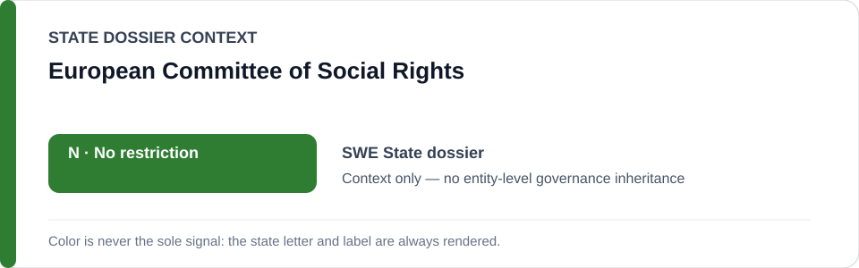
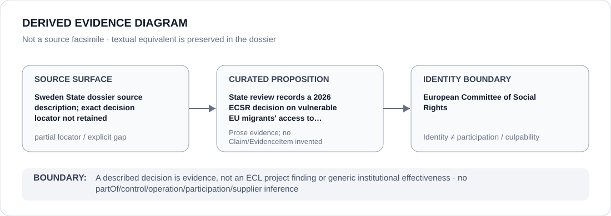

# European Committee of Social Rights

> **Canonical per-entity evidence/provenance record.** This dossier has no licensing effect by itself and carries no standalone `provisional_outcome`.

## Identity scope

European Committee of Social Rights (ECSR), represented as the regional rights-monitoring institution named in the `SWE` State dossier for a 2026 decision concerning vulnerable EU migrants' access to healthcare. A monitoring/adjudicative decision is evidence, not an ECL governance surface for the Committee.

## State governance context

The canonical `SWE` State dossier records **N — No current State-level or defined-project basis**. It nevertheless treats European social-rights findings as material scrutiny evidence while concluding that the reviewed record does not establish a current ECL §5 prohibited project. State `N` is context only and is not inherited as an institutional finding.

## Evidence record

- The Sweden dossier records a 2026 European Committee of Social Rights decision concerning vulnerable EU migrants' access to healthcare and serious discriminatory exclusion.
- Its source section preserves that record only as a textual source description; it does not retain an exact decision URL, case identifier or document locator.
- The State dossier also records discontinuation of a previously documented discriminatory automated benefits-risk model, which is why the social-rights finding is not silently converted into a current ECL automated-project determination.

## Attribution and exclusions

The ECSR decision, its monitoring function and the Swedish social-policy proposition do not establish participation, control, implementation, culpability or generic institutional effectiveness for the Committee.

## Visual evidence

The diagram explicitly renders the missing exact decision locator as a partial provenance surface.

## Evidence gaps

The normalized repository does not retain the exact 2026 ECSR decision locator or case identifier. This dossier preserves the State dossier's description only and does not externally reconstruct the missing citation.

## Sources

- [Canonical Sweden State dossier](../states/SWE.md)
- State-dossier source description: “European Committee of Social Rights 2026 decision concerning vulnerable EU migrants' access to healthcare.”

## Governance boundary

A described decision is evidence, not an ECL project finding or proof of generic institutional effectiveness. State `N` does not propagate into an entity-level outcome.
