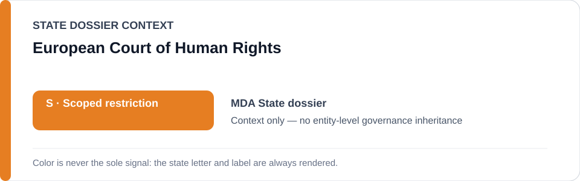
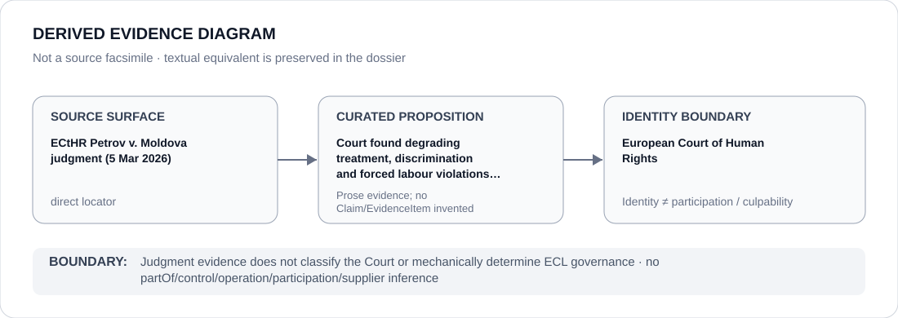

# European Court of Human Rights

> **Canonical per-entity evidence/provenance record.** This dossier has no licensing effect by itself and carries no standalone `provisional_outcome`.

## Identity scope

The European Court of Human Rights (ECtHR), represented as the external court whose judgments are retained as proposition-specific human-rights evidence in the Moldova record. A judgment concerning Moldova is evidence about the underlying State conduct and remedy obligations; it does not assign an ECL status to the Court.

## State governance context

The canonical `MDA` State dossier records **S — Scoped restriction** for defined detention, ill-treatment/remedy and three-penitentiary informal-prisoner-hierarchy projects. State `S` is context only and is not inherited by the European Court of Human Rights.

## Evidence record

- On 5 March 2026, the Court's **Petrov v. the Republic of Moldova (no. 38066/18)** judgment found violations arising from degrading treatment, discrimination and forced labour linked to the informal prisoner hierarchy and the authorities' failure to protect the applicant.
- The Moldova dossier uses that judgment alongside CPT and execution-supervision evidence to support the current, tightly bounded three-facility detention proposition.
- The judgment remains a judicial evidence surface; the ECL scope and Schedule boundary are determined separately by the repository's governance process.

## Attribution and exclusions

Adjudicating a case, issuing a judgment or being cited by a State dossier does not make the Court a participant in the underlying detention project. No State status, respondent-State conduct, prison administration, control, operation or Material Participation is attributed to the Court.

## Visual evidence

The diagram preserves the judgment as a direct evidence surface and terminates at Court identity rather than converting adjudication into an ECL outcome.

## Evidence gaps

This dossier records only the proposition for which the current Moldova dossier retains an exact ECtHR locator. It does not generalize from Petrov to every ECtHR judgment, every Moldovan detention case or Court effectiveness.

## Sources

- [Canonical Moldova State dossier](../states/MDA.md)
- [ECtHR — Petrov v. the Republic of Moldova judgment record](https://www.echr.coe.int/w/judgment-concerning-the-republic-of-moldova-6)

## Governance boundary

A judicial finding about Moldova is evidence concerning the respondent State and exact case. It does not propagate Moldova's `S`, project participation, culpability or a generic effectiveness finding to the European Court of Human Rights.
