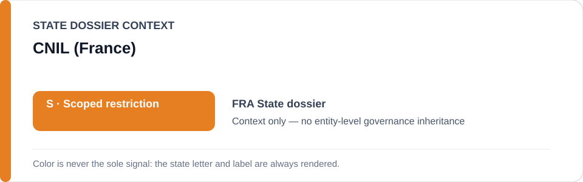
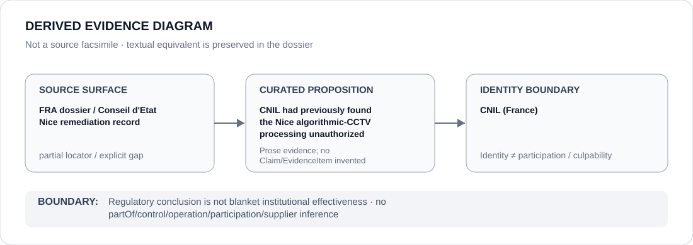

# CNIL (France)

> **Canonical per-entity evidence/provenance record.** This dossier has no licensing effect by itself and carries no standalone `provisional_outcome`.

## Identity scope

CNIL, represented here only as the French data-protection regulator credited in the France State dossier with having reached the same legal conclusion later reflected in the Conseil d'État's binding remediation of the Nice school-entrance algorithmic-CCTV project.

## State governance context

The canonical `FRA` State dossier records **S — Restricted with defined scope**, while expressly removing the judicially blocked Nice system from that scope. The red `S` is **State context only** and is not inherited by CNIL.

## Evidence record

- The France State dossier records that on 30 January 2026 the Conseil d'État held Nice's algorithmic processing of public-street CCTV at school entrances unauthorized under existing law.
- The same canonical record states that **CNIL had previously reached the same conclusion**.
- The historical scoped review characterizes that regulatory/judicial sequence as concrete counter-institutional remediation and requires the Nice project to leave the active restricted scope.
- The repository preserves an exact Conseil d'État locator for the binding decision, but not an exact CNIL decision/opinion locator for CNIL's earlier conclusion.

## Attribution and exclusions

CNIL's prior conclusion does not establish blanket regulatory effectiveness, enforcement success across unrelated algorithmic-surveillance systems or responsibility for the underlying Nice deployment. The national VSA experiment, public-order projects and legislative proposals are not attributed to CNIL by regulator identity.

## Visual evidence

The diagram marks the source surface as partial because the CNIL proposition is explicit in canonical repository prose but the retained exact external locator is the Conseil d'État remediation record rather than a CNIL-specific source.

## Evidence gaps

The exact CNIL decision, opinion, docket, publication date and regulator-hosted URL supporting the earlier Nice conclusion are not preserved in the current canonical corpus. Those details remain open rather than being reconstructed from general knowledge.

## Sources

- [Conseil d'État — Nice algorithmic CCTV ruling](https://www.conseil-etat.fr/actualites/nice-le-traitement-algorithmique-des-images-de-videosurveillance-de-la-voie-publique-n-est-en-l-etat-actuel-de-la-loi-pas-autorise)
- [Canonical France State dossier](../states/FRA.md)
- [Scoped adversarial review — tranche 1](../../reviews/2026/adversarial/scoped/tranche-01.md)

## Governance boundary

A regulator's adverse legal conclusion and a project-level remediation do not create a standalone ECL designation for CNIL. State `S`, dossier adjacency and visual adjacency do not imply governance, control, operation, participation or Material Participation.
