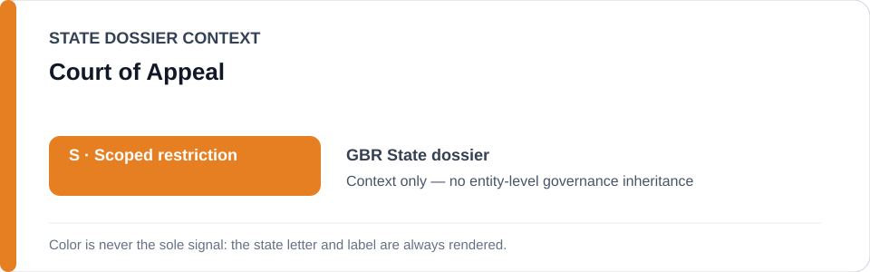
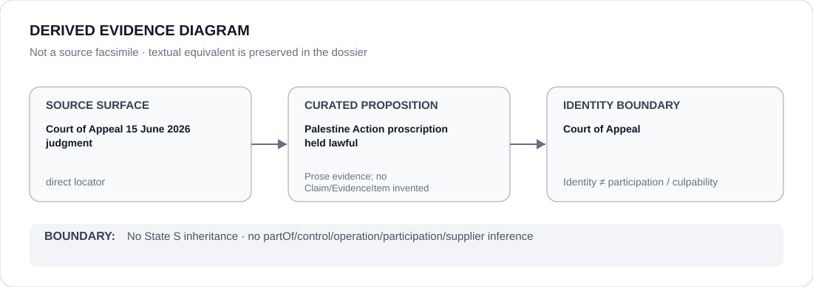

# Court of Appeal

> **Canonical per-entity evidence/provenance record.** This dossier has no licensing effect by itself and carries no standalone `provisional_outcome`.

## Identity scope

The Court of Appeal referenced in the United Kingdom dossier's 2026 Palestine Action proscription litigation.

## State governance context

The canonical `GBR` State dossier currently records **S — Scoped restriction**. That status is shown below as **context only** and is not inherited by the Court of Appeal.

## Evidence record

- The UK dossier records that a Divisional Court initially quashed the Palestine Action proscription decision.
- On **15 June 2026**, the Court of Appeal reversed that result and held the proscription lawful.
- The dossier treats the existence and operation of judicial review as strong counter-institutional evidence against whole-State attribution, while preserving the scoped review of specified enforcement systems.

## Attribution and exclusions

A judgment upholding the proscription does not make the Court a participant in every downstream enforcement action. This dossier does not infer control of police/CPS/Home Office conduct and assigns no standalone `S` outcome to the Court.

## Visual evidence

The diagram uses the exact 15 June 2026 Court of Appeal judgment as a direct locator and separates judicial adjudication from later enforcement.

## Evidence gaps

This dossier does not encode the litigation as structured Claims or attempt to score the substantive correctness of the judgment. It preserves the procedural proposition relevant to ECL attribution.

## Sources

- [Court of Appeal — Home Secretary v Huda Ammori](https://www.judiciary.uk/judgments/home-secretary-v-huda-ammori/)
- [Canonical State dossier provenance](../states/GBR.md)

## Governance boundary

Identity and judicial review do not create `partOf`, enforcement participation, control, culpability or Material Participation relations. The orange `S` is State context only.
