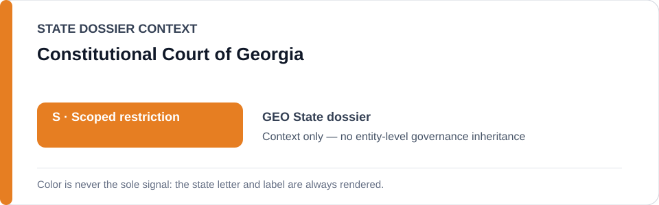
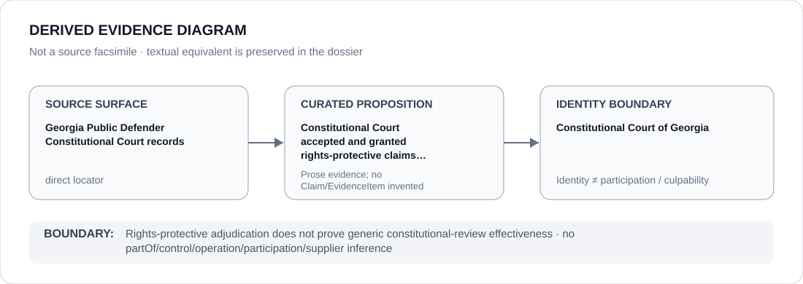

# Constitutional Court of Georgia

> **Canonical per-entity evidence/provenance record.** This dossier has no licensing effect by itself and carries no standalone `provisional_outcome`.

## Identity scope

Constitutional Court of Georgia, represented as the constitutional-review institution named in the `GEO` State dossier for rights-protective contestability. Constitutional-court identity is not itself an ECL governance classification.

## State governance context

The canonical `GEO` State dossier records **S — Scoped restriction** for executive/police protest repression, politically motivated prosecution/detention, coercive foreign-influence/grant controls and specified media/civic-space repression. State `S` is context only and is not inherited by Constitutional Court of Georgia.

## Evidence record

- The Georgia State dossier retains two direct Public Defender source surfaces concerning Constitutional Court review.
- One records the Public Defender challenging assembly-related prohibitions and liability norms before the Constitutional Court.
- A second records a Constitutional Court ruling granting the Public Defender's constitutional claim concerning involuntary psychiatric treatment.
- The State dossier uses functioning constitutional review, together with other counter-institutions, as evidence against whole-State attribution.

## Attribution and exclusions

The retained review propositions do not establish operation, control or participation by Constitutional Court of Georgia in the executive, police, prosecutorial, foreign-influence or media-control projects described elsewhere in the State dossier. Litigation adjacency creates no Material Participation or culpability inference.

## Visual evidence

The diagram treats the Public Defender's Constitutional Court records as direct evidence surfaces and terminates at constitutional-court identity.

## Evidence gaps

The retained records establish specific access to constitutional review and at least one rights-protective outcome. They do not establish generic effectiveness, implementation of every ruling or institutional independence across all matters.

## Sources

- [Canonical GEO State dossier](../states/GEO.md)
- [Public Defender — assembly restrictions challenged before the Constitutional Court](https://www.ombudsman.ge/eng/191018050024siakhleebi/sakhalkho-damtsveli-shekrebebisa-da-manifestatsiebis-chatarebis-tsestan-dakavshirebul-akrdzalvebsa-da-pasukhismgeblobis-normebs-sakonstitutsio-sasamartloshi-asachivrebs)
- [Public Defender — Constitutional Court granted claim concerning involuntary psychiatric treatment](https://www.ombudsman.ge/eng/akhali-ambebi/sakonstitutsio-sasamartlom-daakmaqofila-sakhalkho-damtsvelis-konstitutsiuri-sarcheli-idzulebiti-fsikiatriuli-mkurnalobastan-dakavshirebit)

## Governance boundary

Rights-protective adjudication does not prove generic constitutional-review effectiveness. State `S` and litigation adjacency do not propagate to Constitutional Court of Georgia.
