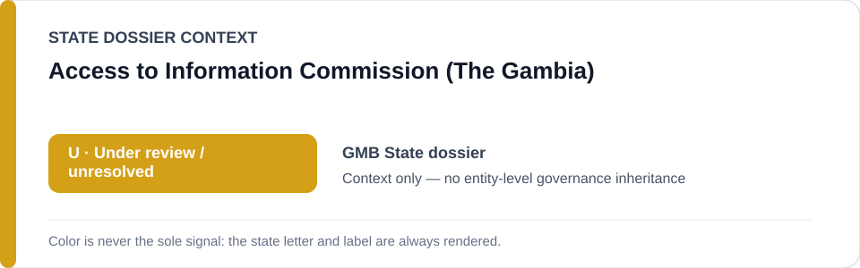
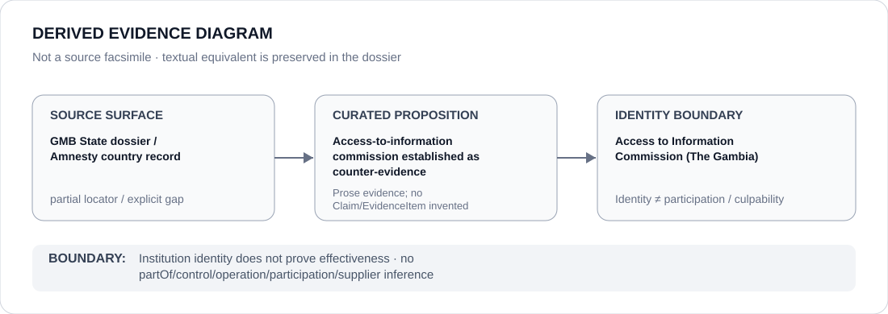

# Access to Information Commission (The Gambia)

> **Canonical per-entity evidence/provenance record.** This dossier has no licensing effect by itself and carries no standalone `provisional_outcome`.

## Identity scope

The Gambian Access to Information Commission, represented as the access-to-information counter-institution identified in the current State review. This record preserves only the identity and proposition actually retained by repository provenance.

## State governance context

The canonical `GMB` State dossier currently records **U — Under Review** for expression/public-order and cyber/media enforcement projects. The Commission is cited as counter-evidence in that review; the State `U` is **context only** and is not inherited by the Commission.

## Evidence record

- The Gambia State dossier records that an Access to Information Commission was established while evaluating whether current evidence supports escalation from `U`.
- It places that institutional development alongside withdrawn criminal cases and advancing accountability mechanisms as counter-evidence against a stable current `S`.
- The State dossier does not make a finding about the Commission's caseload, decisional independence, enforcement powers in practice or remedial effectiveness.

## Attribution and exclusions

Establishment of an access-to-information body does not prove that it remedies every expression/media concern, and it does not attribute police, prosecutorial, cyber or media-enforcement conduct to the Commission. The Commission does not inherit the State review outcome by institutional location.

## Visual evidence

The diagram marks the source surface as partial because the current canonical corpus preserves a country-level Amnesty locator rather than a Commission-specific official or statutory locator.

## Evidence gaps

The reviewed repository provenance does not currently retain an exact Commission website, establishing instrument, decision, docket or 2026 activity record. Those are open provenance gaps; this dossier does not reconstruct them from general knowledge.

## Sources

- [Amnesty International — Gambia country record](https://www.amnesty.org/en/location/africa/west-and-central-africa/gambia/report-gambia/)
- [Canonical Gambia State dossier](../states/GMB.md)

## Governance boundary

Institutional existence and counter-evidence status are not equivalent to independence, effectiveness or a favorable ECL designation. The amber `U` is State context only and cannot propagate governance, control, participation or culpability to this institution.
