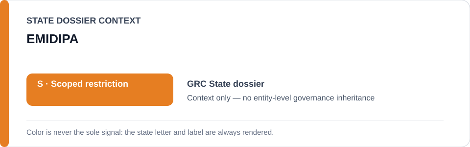
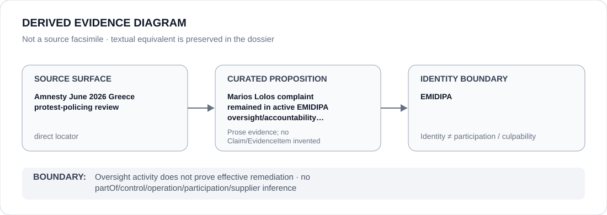

# EMIDIPA

> **Canonical per-entity evidence/provenance record.** This dossier has no licensing effect by itself and carries no standalone `provisional_outcome`.

## Identity scope

EMIDIPA, represented only as the Greek oversight mechanism named in the Marios Lolos accountability record. This dossier preserves the oversight proposition without converting it into a finding of completed or effective remediation.

## State governance context

The canonical `GRC` State dossier records **S — Restricted with defined scope** and freezes only the 26 January 2025 Athens Tempi-demonstration stun-grenade / Marios Lolos incident and accountability project. EMIDIPA and other remedial functions are expressly excluded from that frozen project. The red `S` is **State context only** and is not inherited by EMIDIPA.

## Evidence record

- Amnesty's June 2026 protest-policing review, as normalized in the Greece State dossier, reports that photojournalist Marios Lolos lodged a complaint with EMIDIPA after being struck in the head by a stun grenade on 26 January 2025.
- At the cutoff, a criminal investigation and police disciplinary investigation were also active, so the incident remained in an active accountability posture rather than being treated as durably remediated.
- The State dossier treats EMIDIPA oversight and the parallel investigations as important counter-evidence and excludes those remedial functions from the restricted project.

## Attribution and exclusions

Receipt/oversight of a complaint does not prove identification of responsible personnel, an effective remedy, institutional independence in every case or durable policing reform. EMIDIPA is not attributed the stun-grenade deployment, protest-policing operation or any obstruction merely because it appears in the same case record.

## Visual evidence

The diagram links the proposition-specific Amnesty Greece review to the active EMIDIPA complaint/oversight posture and stops at the institution identity boundary.

## Evidence gaps

This dossier does not preserve an EMIDIPA-hosted docket, decision or final case outcome. Completion, remedy, identification and institutional effectiveness remain review triggers rather than assumed facts.

## Sources

- [Amnesty International — Greece protest-policing review](https://www.amnesty.org/en/documents/eur25/1012/2026/en/)
- [Amnesty International — June 2026 Greece policing release](https://www.amnesty.org/en/latest/news/2026/06/greece-dangerous-policing-tactics-have-turned-peaceful-protests-into-battlefields/)
- [Canonical Greece State dossier](../states/GRC.md)

## Governance boundary

Oversight activity and exclusion from the frozen project do not create a favorable governance score for EMIDIPA. State `S` and case adjacency do not imply control, participation, culpability or completed remediation.
