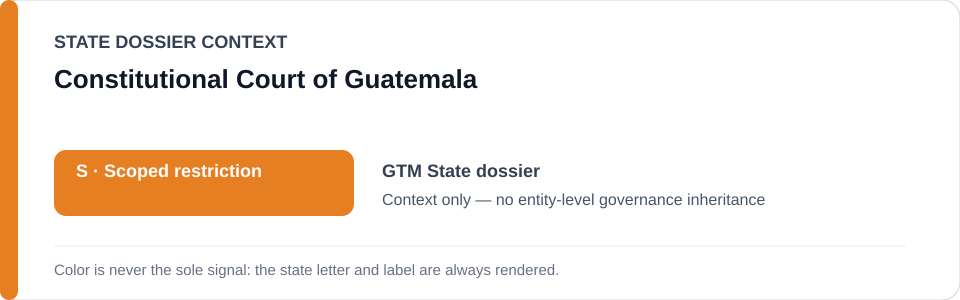
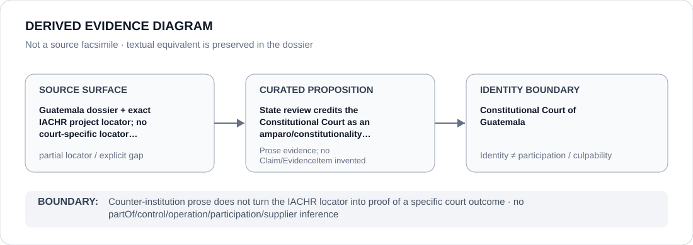

# Constitutional Court of Guatemala

> **Canonical per-entity evidence/provenance record.** This dossier has no licensing effect by itself and carries no standalone `provisional_outcome`.

## Identity scope

Constitutional Court of Guatemala, represented as the institution named in the canonical `GTM` State dossier for the repository-retained proposition below. Identity, mandate, adjudication, oversight, review, implementation or remediation activity does not itself create an ECL governance classification.

## State governance context

The canonical `GTM` State dossier records **S — Scoped restriction**. That State-level status is context only and is not inherited by Constitutional Court of Guatemala.

## Evidence record

- **Source surface:** Guatemala dossier + exact IACHR project locator; no court-specific locator retained.
- **Curated proposition:** State review credits the Constitutional Court as an amparo/constitutionality counter-institution.
- The proposition is preserved only at the granularity supported by the repository. It is not promoted into a new structured `Claim`, `EvidenceItem`, relation edge or Material Participation finding.
- State-dossier attribution remains separate from institution identity; evidence produced by, concerning or adjacent to an institution does not establish operation, control, culpability, supply, command or participation in conduct described elsewhere.

## Attribution and exclusions

Counter-institution prose does not turn the IACHR locator into proof of a specific court outcome. State `S`, institutional class membership and dossier/source adjacency do not propagate into a generic finding about Constitutional Court of Guatemala.

## Visual evidence

The diagram encodes the retained source granularity as **partial** and terminates at the institution identity boundary.

## Evidence gaps

The repository preserves the institutional proposition but not a one-to-one exact locator or document mapping at the same granularity. That source-precision gap remains explicit; no external reconstruction or inferred citation is inserted.

## Sources

- [Canonical GTM State dossier](../states/GTM.md)
- https://www.oas.org/en/iachr/decisions/mc/2026/res_40-26_mc_171-25_gt_en.pdf

## Governance boundary

This migration records identity and provenance only. It changes no State outcome, scope, Schedule entry, actor relationship, licensing effect or entity-level governance status.
