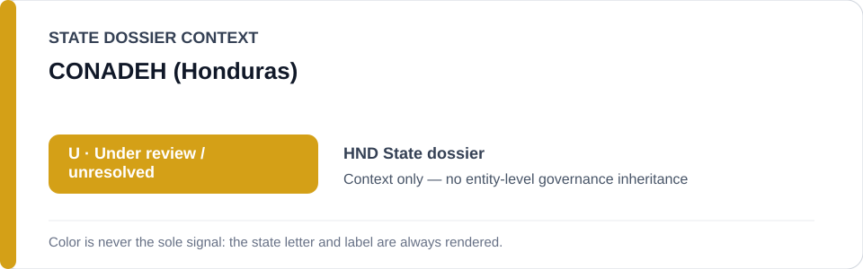
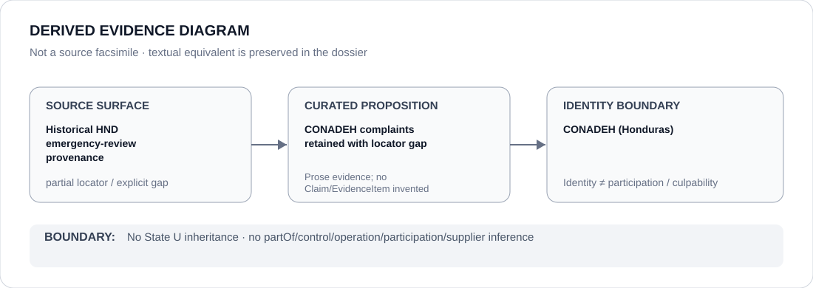

# CONADEH (Honduras)

> **Canonical per-entity evidence/provenance record.** This dossier has no licensing effect by itself and carries no standalone `provisional_outcome`.

## Identity scope

The Honduran human-rights/accountability institution identified as CONADEH in the historical emergency-review provenance for Honduras. The short-form `CONADEH` remains State-scoped and is not merged with unrelated institutions.

## State governance context

The canonical `HND` State dossier currently records **U — Under Review / unresolved** after the nationwide state-of-exception project ended in January 2026. That status is shown below as **context only** and is not inherited by CONADEH.

## Evidence record

- The Honduras dossier preserves historical references to CONADEH complaints concerning the former nationwide state of exception together with Amnesty/rights reporting and later government security-policy statements.
- That historical record supported review of alleged arbitrary detention, torture/ill-treatment, false evidence, property abuse and other coercive police/security conduct during the former emergency project.
- The current State dossier expressly records that the nationwide project ceased and that historical severity does not by itself restore an active `S` scope.

## Attribution and exclusions

CONADEH's appearance in complaint/accountability provenance does not attribute the former emergency project, police/security conduct or later security policy to CONADEH. It also does not establish the effectiveness or completeness of legacy accountability. No standalone `U` or adverse finding attaches to this institution.

## Visual evidence

The diagram deliberately labels the source surface as partial because the historical tranche and dossier preserve the CONADEH reference without an exact source URL or document identifier.

## Evidence gaps

The repository's historical normalization found no precise CONADEH locator beyond the tranche/dossier text for the older emergency record. That locator gap is preserved rather than reconstructed externally, and no missing complaint detail is fabricated.

## Sources

- [Canonical State dossier provenance](../states/HND.md)
- [Historical scoped review tranche](../../reviews/2026/adversarial/scoped/tranche-04.md)
- [Later under-review revalidation](../../reviews/2026/adversarial/under-review/full-cohort.md)

## Governance boundary

Identity and historical complaint provenance do not create police/security participation, control, culpability, Material Participation or a revived emergency-project finding. The yellow `U` is State context only.
