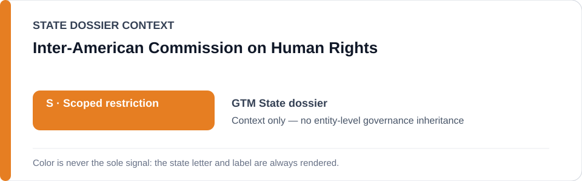
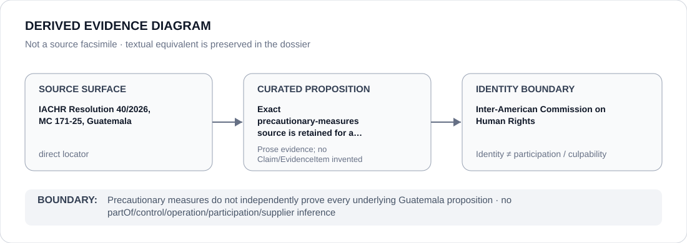

# Inter-American Commission on Human Rights

> **Canonical per-entity evidence/provenance record.** This dossier has no licensing effect by itself and carries no standalone `provisional_outcome`.

## Identity scope

The Inter-American Commission on Human Rights (IACHR), represented as the inter-American human-rights institution whose exact 2026 precautionary-measures record is retained in the Guatemala dossier. The Commission's decision is an evidence source, not an ECL governance decision.

## State governance context

The canonical `GTM` State dossier records **S — Scoped restriction** for defined Public Ministry/FECI, prosecutorial, detention and implicated judicial criminalization projects. State `S` is context only and is not inherited by the IACHR.

## Evidence record

- The Guatemala dossier retains the exact IACHR **Resolution 40/2026, MC 171-25** locator recovered from the civic-security Schedule batch.
- The locator is associated with the capacity-limited Guatemala criminalization/detention project.
- The State dossier expressly refuses to over-promote that source into independent proof of the separate Pacheco/Chaclán proposition or every wider 2025/26 criminalization allegation.

## Attribution and exclusions

Issuing precautionary measures, receiving petitions or being used as external human-rights provenance does not make the IACHR a participant in Guatemala's prosecutorial or detention projects. No respondent-State conduct or State governance status is inherited.

## Visual evidence

The diagram shows the exact precautionary-measures source and preserves the proposition-specific non-overpromotion boundary.

## Evidence gaps

The repository does not map Resolution 40/2026 to every distinct Guatemala criminalization proposition. Those proposition-specific gaps remain explicit rather than being filled from institutional identity or external memory.

## Sources

- [Canonical Guatemala State dossier](../states/GTM.md)
- [IACHR Resolution 40/2026 — MC 171-25](https://www.oas.org/en/iachr/decisions/mc/2026/res_40-26_mc_171-25_gt_en.pdf)
- [Civic-security Schedule batch](../../registry/schedule-state-s-batches/batch-05-civic-security.yml)

## Governance boundary

A precautionary-measures decision is a source surface with its own proposition limits. It does not create a generic IACHR outcome, prove every underlying allegation or transmit Guatemala's `S` to the Commission.
