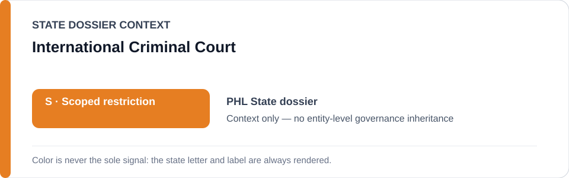
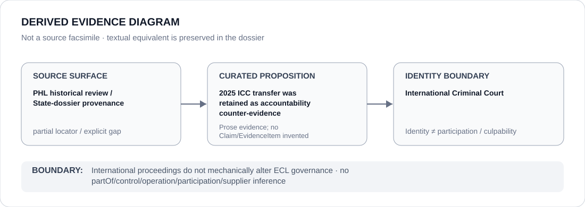

# International Criminal Court

> **Canonical per-entity evidence/provenance record.** This dossier has no licensing effect by itself and carries no standalone `provisional_outcome`.

## Identity scope

The International Criminal Court (ICC), represented as the international accountability institution referenced in the Philippines review history. This record does not assign the ICC a national jurisdiction field and does not treat international proceedings as an ECL governance decision.

## State governance context

The canonical `PHL` State dossier records **S — Restricted with an incident-specific subset**. Its historical review retains the 2025 ICC transfer of former President Rodrigo Duterte as counter-evidence/accountability context while the current Schedule freeze is limited to an unrelated January 2026 Malate Police Station 9 SDEU incident. The red `S` is **Philippines State context only** and is not inherited by the ICC.

## Evidence record

- The Philippines State dossier's historical-evidence section records that the earlier adversarial tranche treated the **2025 ICC transfer of former President Rodrigo Duterte** as counter-evidence.
- The same canonical record explicitly says the surviving pre-revalidation dossier confirms that proposition but does **not** preserve an exact proposition-specific locator for it.
- The current Philippines restriction is instead a finite January 2026 domestic police incident; ICC identity or proceedings do not define or broaden that freeze.

## Attribution and exclusions

Transfer to, proceedings before or accountability activity by the ICC do not mechanically alter ECL governance and do not create a relation between the ICC and the current restricted police incident. This dossier makes no finding on criminal guilt, case merits, jurisdictional disputes or the effectiveness of ICC proceedings.

## Visual evidence

The diagram marks the evidence source as partial because the repository preserves the historical proposition without an exact ICC case/transfer locator.

## Evidence gaps

The canonical corpus does not preserve the exact ICC proceeding, transfer document, case page or proposition-specific external URL used by the historical review. It also does not encode the procedural status or outcome of those proceedings here.

## Sources

- [Canonical Philippines State dossier](../states/PHL.md)
- Repository historical provenance: `reviews/2026/adversarial/scoped/tranche-07.md` as referenced by the canonical State dossier.

## Governance boundary

International accountability proceedings are contextual evidence, not an automatic ECL tier transition or institutional designation. State `S`, international-court identity and historical adjacency do not create control, participation, culpability or Material Participation relations.
