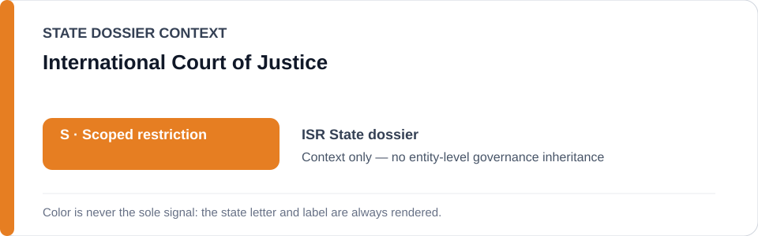
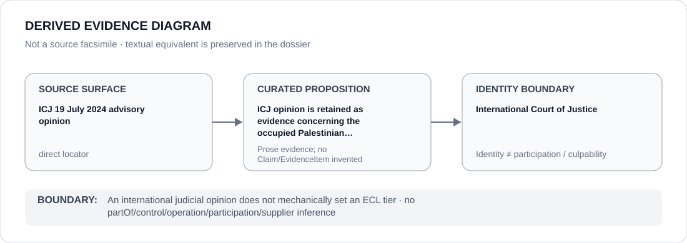

# International Court of Justice

> **Canonical per-entity evidence/provenance record.** This dossier has no licensing effect by itself and carries no standalone `provisional_outcome`.

## Identity scope

The International Court of Justice (ICJ), represented as the international judicial institution whose 19 July 2024 advisory opinion is retained as direct evidence in the Israel State dossier. The opinion is an evidence/legal source, not an ECL GovernanceDecision.

## State governance context

The canonical `ISR` State dossier records **S — Restricted with defined scope** after narrowing a former whole-State `R`. The ICJ opinion contributes to the evidence preserving scoped restrictions, while independent judicial/audit/remedial functions constrain attribution. The red `S` is **Israel State context only** and is not inherited by the ICJ.

## Evidence record

- The Israel dossier directly cites the ICJ's 19 July 2024 advisory opinion.
- The canonical synthesis records that the opinion found Israel's continued presence in the occupied Palestinian territory unlawful and identified violations concerning Palestinian self-determination and systemic discrimination.
- The State dossier uses those findings as part of the evidentiary basis for restrictions following the organs/projects materially implementing qualifying conduct, not for a blanket transfer of legal findings into every ECL classification.

## Attribution and exclusions

An ICJ advisory opinion does not itself assign an ECL tier, identify Material Participation under the license or create a relation between the Court and the conduct it adjudicates. This dossier makes no claim that international judicial findings and ECL criteria are legally coextensive.

## Visual evidence

The diagram links the direct ICJ source to the limited proposition that the opinion is retained as evidence in the State review and then stops at the Court identity boundary.

## Evidence gaps

This dossier does not restate the full advisory opinion, resolve subsequent compliance or proceedings, or translate every international-law finding into ECL §5. Those are separate legal/evidentiary questions.

## Sources

- [International Court of Justice — 19 July 2024 advisory opinion record](https://www.icj-cij.org/index.php/node/204160)
- [Canonical Israel State dossier](../states/ISR.md)

## Governance boundary

An international judicial opinion is evidence, not a mechanical ECL outcome. Israel `S`, Court identity and source citation do not create governance, control, participation or culpability for the ICJ.
