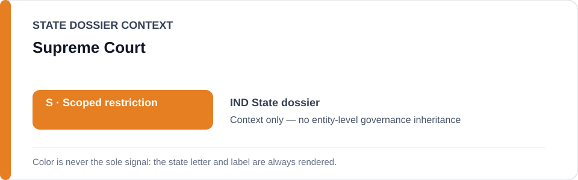
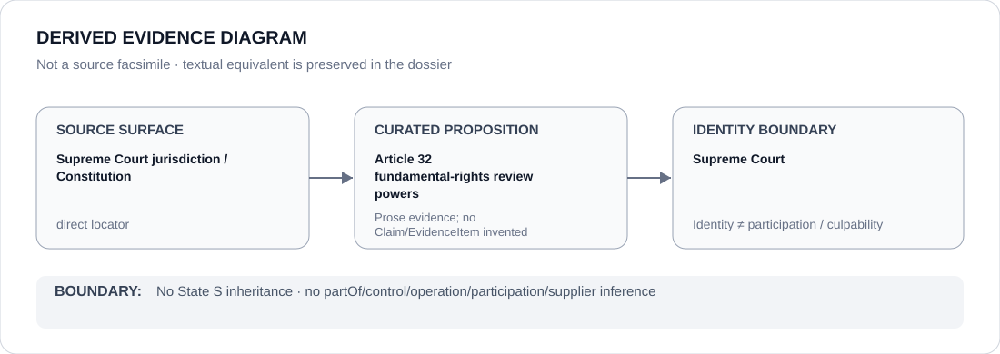

# Supreme Court

> **Canonical per-entity evidence/provenance record.** This dossier has no licensing effect by itself and carries no standalone `provisional_outcome`.

## Identity scope

India's Supreme Court, represented as the State-scoped constitutional court described in the India dossier. The generic name is not merged with same-named courts in other jurisdictions.

## State governance context

The canonical `IND` State dossier currently records **S — Scoped restriction**. That status is shown below as **context only** and is not inherited by the Supreme Court.

## Evidence record

- The India dossier records substantial Supreme Court/High Court review powers as counter-evidence against whole-State attribution.
- It specifically records Article 32 direct Supreme Court jurisdiction to enforce Fundamental Rights through habeas corpus and other writs.
- Judicial safeguards against arbitrary punitive demolition are also treated as counter-evidence, while the current active scope remains project-specific.

## Attribution and exclusions

Constitutional jurisdiction does not establish that every remedy is effective or complied with. This dossier does not attribute Union/state security, police, censorship or surveillance projects to the Court and assigns no standalone `S` status.

## Visual evidence

The diagram uses the Supreme Court's own jurisdiction/constitutional surfaces as direct source locators and preserves the distinction between review powers and executive projects.

## Evidence gaps

This dossier does not enumerate all 2026 Supreme Court cases relevant to the State dossier or encode particular writ outcomes as structured Claims.

## Sources

- [Supreme Court of India — jurisdiction](https://www.sci.gov.in/jurisdiction/)
- [Supreme Court of India — Constitution](https://www.sci.gov.in/constitution/)
- [Canonical State dossier provenance](../states/IND.md)

## Governance boundary

Identity and constitutional review do not create security/police participation, executive control, culpability or Material Participation. The orange `S` is State context only.
