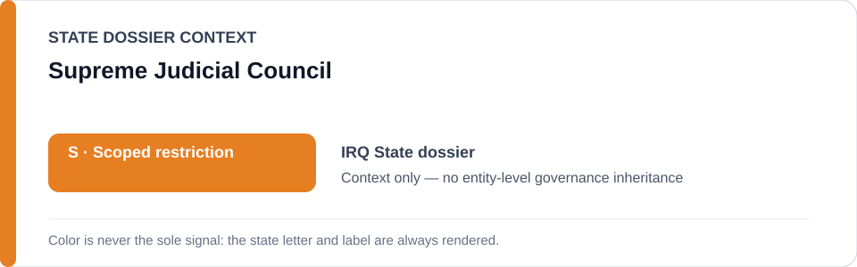
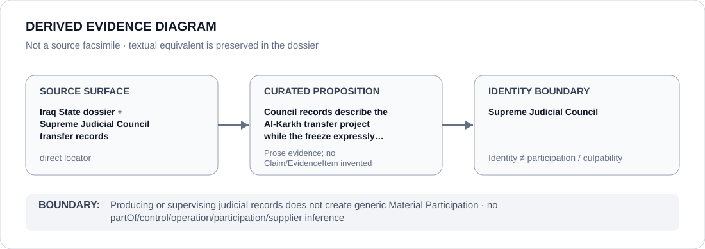

# Supreme Judicial Council

> **Canonical per-entity evidence/provenance record.** This dossier has no licensing effect by itself and carries no standalone `provisional_outcome`.

## Identity scope

This dossier represents **Supreme Judicial Council** as the institution identified in the canonical `IRQ` review record. Identity is kept separate from any case, project, authority, member, subordinate body or participant unless the repository supplies a separate attributable relation or Claim.

## State governance context

The canonical `IRQ` State dossier records **S — Scoped restriction**. That State status is context only. It is not inherited by Supreme Judicial Council, and neither institutional class membership nor adjacency to the State dossier creates an entity-level governance outcome.

## Evidence record

- **Source granularity:** `direct`. The repository retains an exact source surface adequate for the curated proposition below.
- **Curated proposition:** Council records describe the Al-Karkh transfer project while the freeze expressly excludes the Council generally.
- The source surface is used only for that proposition and its provenance boundary. It is not promoted into evidence for unrelated conduct, generic institutional effectiveness, control, participation or culpability.
- The Iraq freeze expressly excludes the Supreme Judicial Council generally; the narrow project boundary applies only to materially participating abusive custodial/interrogation capacities.

## Attribution and exclusions

Producing or supervising judicial records does not create generic Material Participation. No `partOf`, control, operation, supply, command, membership, participation or Material Participation edge is inferred from this dossier.

## Visual evidence

The diagram is derived from the manifest and terminates at the identity boundary. It is not a source facsimile and does not add a Claim or EvidenceItem.

## Evidence gaps

No source-precision gap is asserted for the curated proposition. That does not extend locator-completeness to unrelated Council activity or every Al-Karkh sub-proposition.

## Sources

- [Canonical Iraq State dossier](../states/IRQ.md)
- https://www.sjc.iq/ncijcen.79111/
- https://www.sjc.iq/view.79141/
- [Al-Karkh freeze](../../registry/schedule-state-s-freezes/batch-22b-irq-freeze.yml)

## Governance boundary

Producing or supervising judicial records does not create generic Material Participation. State `S` is contextual only and the Council generally remains expressly outside the frozen attribution.
