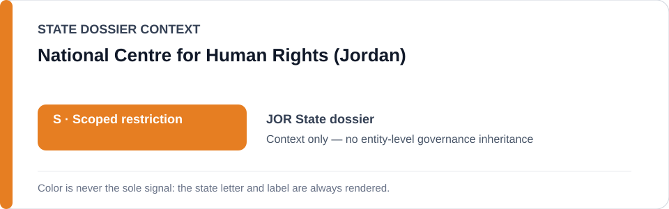
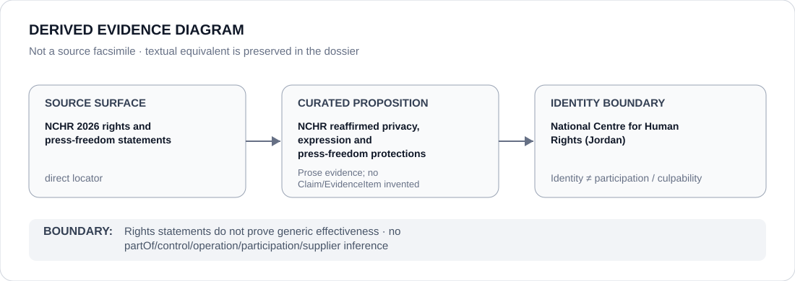

# National Centre for Human Rights (Jordan)

> **Canonical per-entity evidence/provenance record.** This dossier has no licensing effect by itself and carries no standalone `provisional_outcome`.

## Identity scope

Jordan's National Centre for Human Rights (NCHR), represented as the human-rights counter-institution whose 2026 public statements are preserved as direct counter-evidence in the Jordan State dossier.

## State governance context

The canonical `JOR` State dossier records **S — Restricted with defined scope** for specific expression-punishment, administrative-detention, cybercrime and media-blocking projects. NCHR is expressly excluded from that scope. The red `S` is **State context only** and is not inherited by NCHR.

## Evidence record

- The Jordan State dossier records that in 2026 NCHR publicly reaffirmed constitutional protection of privacy, opinion, expression and press freedom and the role of a free press in accountability.
- The canonical corpus preserves direct NCHR statement URLs for Arab Human Rights Day and World Press Freedom Day.
- The later Schedule translation retains the NCHR press-freedom statement as counter-institutional/context provenance and explicitly does not use it as conduct evidence for the separate detention, Sanduka or media-blocking propositions.

## Attribution and exclusions

Public rights statements do not by themselves prove institutional effectiveness, successful remedy, enforcement power or compliance by other State actors. NCHR is not attributed State Security Court cases, governor detention, cybercrime enforcement or Media Commission blocking by institutional adjacency.

## Visual evidence

The diagram links direct NCHR source material to the limited proposition about its 2026 rights/press-freedom statements and stops at the institution identity boundary.

## Evidence gaps

This dossier does not establish NCHR's case-level remedies, implementation rate, independence across all matters or the practical effect of its statements on the projects under State review.

## Sources

- [NCHR — Arab Human Rights Day statement](https://nchr.org.jo/en/statements/statement-issued-by-the-national-centre-for-human-rights-on-the-occasion-of-the-arab-human-rights-day/)
- [NCHR — World Press Freedom Day statement](https://nchr.org.jo/en/statements/statement-on-world-press-freedom-day/)
- [Canonical Jordan State dossier](../states/JOR.md)

## Governance boundary

Rights advocacy and counter-evidence status do not create a standalone ECL outcome for NCHR. State `S` is context only; institutional identity does not imply participation in or responsibility for the scoped coercive projects.
