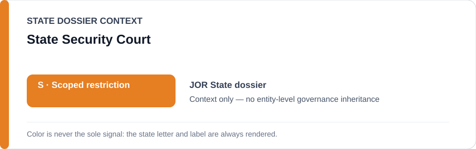
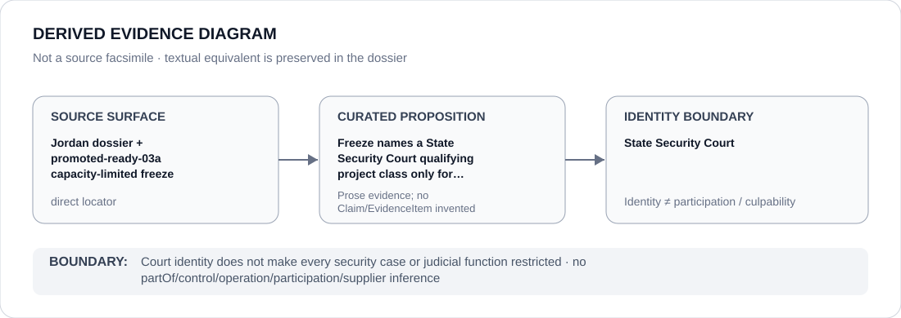

# State Security Court

> **Canonical per-entity evidence/provenance record.** This dossier has no licensing effect by itself and carries no standalone `provisional_outcome`.

## Identity scope

This dossier represents **State Security Court** as the institution identified in the canonical `JOR` review record. Identity is separate from any particular case, prosecutor, security body or judicial function unless separately attributed.

## State governance context

The canonical `JOR` State dossier records **S — Scoped restriction**. That status is context only and is not inherited by the State Security Court.

## Evidence record

- **Source granularity:** `direct`. The repository's promoted-ready freeze names the `State Security Court / Media Commission / governor detention qualifying project class` and imposes a case/order/detention-specific capacity limit.
- **Curated proposition:** Freeze names a State Security Court qualifying project class only for case-specific expression/security enforcement.
- This is not a generic security-judicial class and does not attach to every court action.

## Attribution and exclusions

Court identity does not make every security case or judicial function restricted. No hierarchy, control, participation, culpability or Material Participation inference follows from identity alone.

## Visual evidence

## Evidence gaps

No source-precision gap is asserted for the capacity-limited repository proposition. Individual cases still require their own evidentiary support.

## Sources

- [Canonical Jordan State dossier](../states/JOR.md)
- [Promoted capacity-limited Jordan freeze](../../registry/schedule-state-s-freezes/promoted-ready-03a.yml)
- https://www.amnesty.org/en/location/middle-east-and-north-africa/middle-east/jordan/report-jordan/
- https://www.amnesty.org/en/documents/mde16/0998/2026/en/

## Governance boundary

Court identity does not make every security case or judicial function restricted. State `S` and a capacity-limited Schedule translation never become a generic institution-level outcome.
