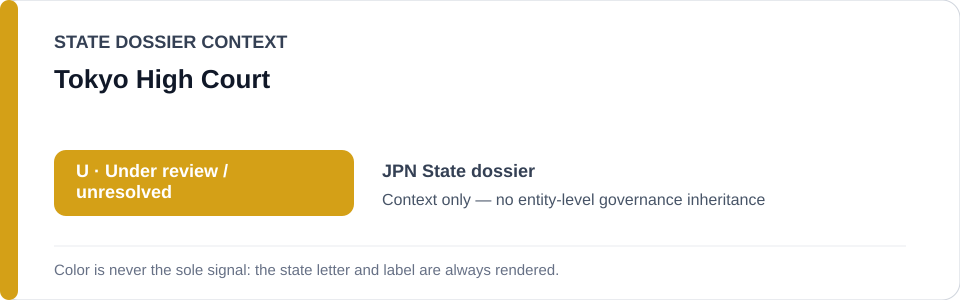
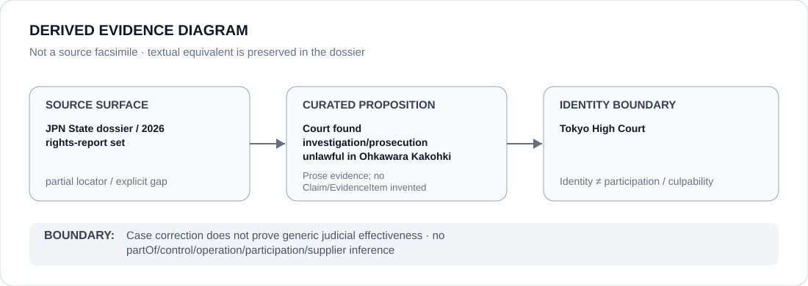

# Tokyo High Court

> **Canonical per-entity evidence/provenance record.** This dossier has no licensing effect by itself and carries no standalone `provisional_outcome`.

## Identity scope

The Tokyo High Court, represented as the Japanese appellate court credited in the current State dossier with finding investigation/prosecution unlawful in the Ohkawara Kakohki matter.

## State governance context

The canonical `JPN` State dossier records **U — Under Review** while the formal Exergism pilot remains `insufficient_evidence` for a defined technology/prohibited-use object. Corrective judicial outcomes materially constrain whole-State attribution. The amber `U` is **context only** and is not inherited by the Tokyo High Court.

## Evidence record

- The Japan State dossier explicitly records that the Tokyo High Court found investigation/prosecution unlawful in the Ohkawara Kakohki case.
- It uses this and other acquittal/corrective outcomes as counter-evidence against whole-State inference while continued detention/interrogation concerns remain under review.
- The canonical source list contains current Japan rights-report locators but does not preserve an exact Tokyo High Court judgment/docket URL for the Ohkawara Kakohki ruling.

## Attribution and exclusions

The cited case correction does not establish generic judicial effectiveness or resolve all prolonged-detention concerns. Detention/interrogation practices, prosecution conduct, executions and future data/technology systems are not attributed to the Court by identity.

## Visual evidence

The diagram marks the source locator as partial and stops at the Court identity boundary.

## Evidence gaps

The exact appellate judgment locator, docket, date, operative remedy and implementation record are not preserved in the current repository source set. No missing case metadata is reconstructed by inference.

## Sources

- [Human Rights Watch — Japan World Report 2026](https://www.hrw.org/world-report/2026/country-chapters/japan)
- [Amnesty International — Japan country record](https://www.amnesty.org/en/location/asia-and-the-pacific/east-asia/japan/)
- [Canonical Japan State dossier](../states/JPN.md)

## Governance boundary

A corrective appellate judgment does not create a standalone ECL outcome for the Tokyo High Court. State `U`, formal-assessment adjacency and case citation do not imply governance, control, participation or culpability.
