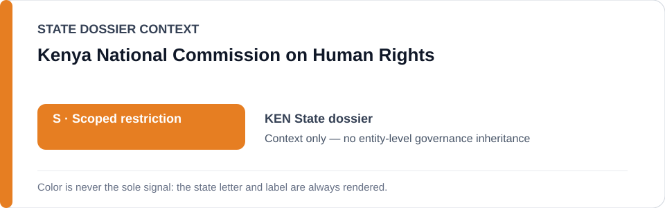
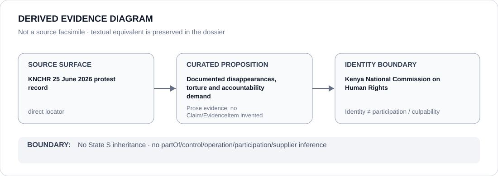

# Kenya National Commission on Human Rights

> **Canonical per-entity evidence/provenance record.** This dossier has no licensing effect by itself and carries no standalone `provisional_outcome`.

## Identity scope

The Kenya National Commission on Human Rights (KNCHR), represented as the constitutional national human-rights institution whose June 2026 reporting is part of the canonical evidence record.

## State governance context

The canonical `KEN` State dossier currently records **S — Scoped restriction**. That status is shown below as **context only**. It is not inherited by KNCHR.

## Evidence record

- On 29 June 2026 KNCHR reported serious violations connected to the 25 June protests, including seven incidents of enforced disappearance.
- The State dossier records six protesters arrested outside Parliament as subsequently released after alleged secret detention and severe torture, alongside arbitrary arrests, unlawful force and media-freedom violations.
- KNCHR monitored the protests, documented individual cases and publicly demanded investigation and accountability; the State dossier therefore treats KNCHR as an exergic counter-institution and expressly excludes it from the active scoped restriction.

## Attribution and exclusions

KNCHR's reporting is evidence provenance. It does not make KNCHR a participant in the abuses it reports, does not establish the truth of every proposition beyond the cited evidentiary record, and does not assign KNCHR a standalone `S` outcome.

## Visual evidence

The diagram is derived from KNCHR's cited record and the canonical State dossier. It is not a photograph or source facsimile.

## Evidence gaps

The current dossier does not yet decompose each named disappearance/torture allegation into separate structured Claims. The exact KNCHR locator is nevertheless retained, so the core source-location gap is closed at prose level.

## Sources

- [KNCHR — 25 June 2026 protest violations record](https://www.knchr.org/Articles/ArtMID/2432/ArticleID/1258/Enforced-Disappearances-Torture-and-other-Human-Rights-Violations-following-the-25th-June-2026-Protests-Marking-the-2nd-Anniversary-of-the-2024-Gen-Z-Protests)
- [KNCHR — institutional homepage](https://www.knchr.org/)
- [Canonical State dossier provenance](../states/KEN.md)

## Governance boundary

Identity, reporting, monitoring, citation or visual adjacency do not create participation, control, command, culpability or Material Participation relations. Any such relation requires separate structured curation.

The orange `S` State-context color is a rendering aid only, not an institution-level designation.
