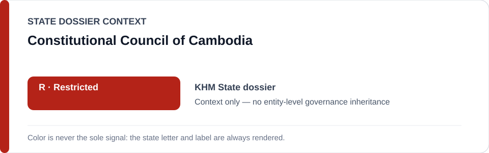
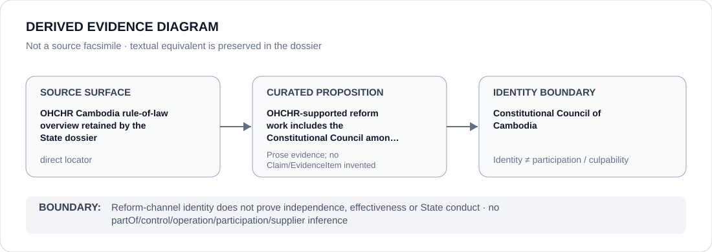

# Constitutional Council of Cambodia

> **Canonical per-entity evidence/provenance record.** This dossier has no licensing effect by itself and carries no standalone `provisional_outcome`.

## Identity scope

This dossier represents **Constitutional Council of Cambodia** as a reform-channel institution named in the canonical Cambodia review. Identity alone does not establish independence, effectiveness, participation or culpability.

## State governance context

The canonical `KHM` State dossier records **R — Restricted** for the State apparatus while expressly preserving OHCHR-supported reform/accountability work. That context is not inherited by the Constitutional Council.

## Evidence record

- **Source granularity:** `direct`.
- **Curated proposition:** OHCHR-supported reform work includes the Constitutional Council among legal and judicial reform channels.
- The OHCHR rule-of-law source is reform/accountability provenance, not conduct evidence for the State restriction.

## Attribution and exclusions

Reform-channel identity does not prove independence, effectiveness or State conduct. No `partOf`, control, operation, participation or Material Participation inference follows.

## Visual evidence

## Evidence gaps

No source-precision gap is asserted for the proposition that the institution is named in the retained reform channel. Generic effectiveness or independence remains unproven by that proposition.

## Sources

- [Canonical Cambodia State dossier](../states/KHM.md)
- https://cambodia.ohchr.org/en/rule-of-law/overview
- [State R identity freeze](../../registry/schedule-state-r-freeze.yml)

## Governance boundary

Reform-channel identity does not prove independence, effectiveness or State conduct. State `R` is context only and qualifying remediation remains separately protected.
