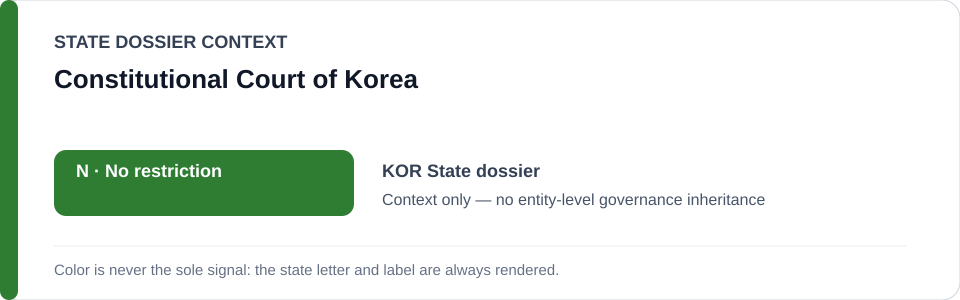
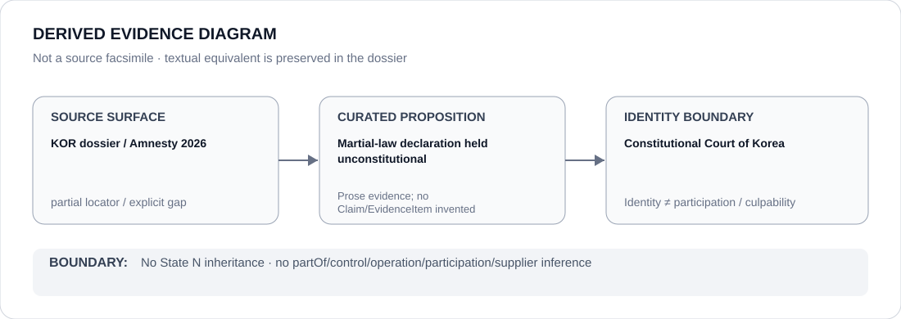

# Constitutional Court of Korea

> **Canonical per-entity evidence/provenance record.** This dossier has no licensing effect by itself and carries no standalone `provisional_outcome`.

## Identity scope

South Korea's Constitutional Court, represented as the constitutional counter-institution credited in the canonical State dossier's correction/contestability record.

## State governance context

The canonical `KOR` State dossier currently records **N — No current state-level basis**. That status is shown below as **context only** and is not inherited by the Constitutional Court.

## Evidence record

- The South Korea State dossier records that the Constitutional Court held the 2024 martial-law declaration unconstitutional.
- The dossier treats that constitutional correction, together with court invalidation of excessive restrictions, as evidence of strong contestability at the 2026 cutoff.
- The State-level `N` result is a governance conclusion about the reviewed State/public-order record, not a designation assigned to the Court itself.

## Attribution and exclusions

A rights-protective constitutional ruling does not prove that every future public-order measure will be corrected or that every Court proceeding is effective. This dossier does not convert one constitutional decision into a generic institutional-performance score.

## Visual evidence

The diagram is a derived representation of the constitutional-correction proposition, not a source facsimile.

## Evidence gaps

The current State dossier preserves the proposition through a general country-report locator rather than an exact Constitutional Court judgment URL or docket reference. The exact decision text and procedural record are therefore marked as a locator gap rather than reconstructed.

## Sources

- [Amnesty International — South Korea 2026 country report](https://www.amnesty.org/en/location/asia-and-the-pacific/east-asia/south-korea/report-south-korea/)
- [Canonical State dossier provenance](../states/KOR.md)

## Governance boundary

Identity, a constitutional ruling, citation or visual adjacency do not create operation, participation, culpability or Material Participation relations. The Court's identity remains separate from the State-level governance determination.

The green `N` State-context color is a rendering aid only, not an institution-level designation.
