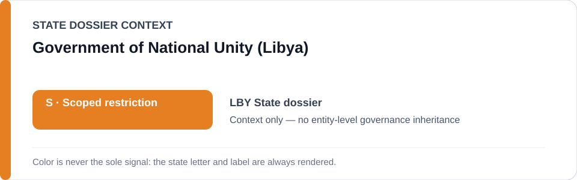
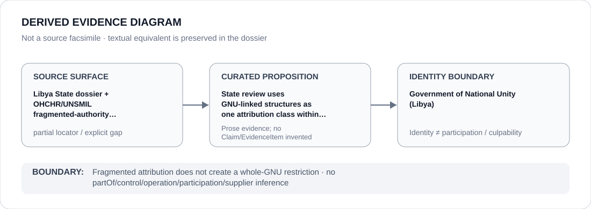

# Government of National Unity (Libya)

> **Canonical per-entity evidence/provenance record.** This dossier has no licensing effect by itself and carries no standalone `provisional_outcome`.

## Identity scope

This dossier represents the **Government of National Unity (Libya)** as one de facto/government authority identity used in the canonical Libya fragmented-attribution record. It is not a proxy for all Libyan public bodies, armed actors or territory.

## State governance context

The canonical `LBY` State dossier records **S — Scoped restriction** under fragmented, actor-specific attribution. The State dossier explicitly rejects a unitary whole-Libya coercive apparatus. State `S` is not inherited by the GNU.

## Evidence record

- **Source granularity:** `partial`.
- **Curated proposition:** State review uses GNU-linked structures as one attribution class within a fragmented de facto-authority map.
- The retained OHCHR/UNSMIL surfaces support the broader fragmented security/detention/migration theory, but the repository does not preserve a one-to-one GNU-only source mapping for every sub-proposition.

## Attribution and exclusions

Fragmented attribution does not create a whole-GNU restriction. Non-attributable private armed groups, independent/remedial functions and unrelated public services remain separate.

## Visual evidence

## Evidence gaps

The dossier remains `partial` because exact source-to-GNU mapping is not complete at every proposition level. No external reconstruction is used to fill that gap.

## Sources

- [Canonical Libya State dossier](../states/LBY.md)
- https://searchlibrary.ohchr.org/record/35248
- https://www.ohchr.org/en/countries/libya
- https://unsmil.unmissions.org/
- [Libya linked-entity freeze](../../registry/schedule-state-s-freezes/batch-11d-lby-link.yml)

## Governance boundary

Fragmented attribution does not create a whole-GNU restriction. Any GNU-specific applicability requires a separately evidenced unit/project/capacity boundary.
